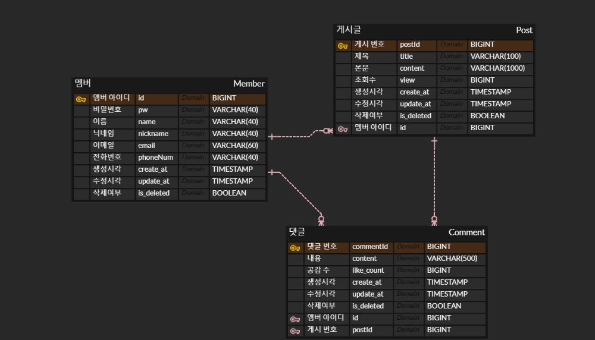
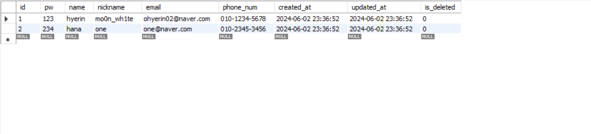
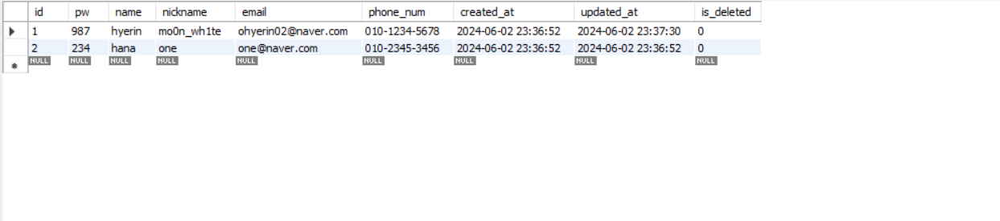
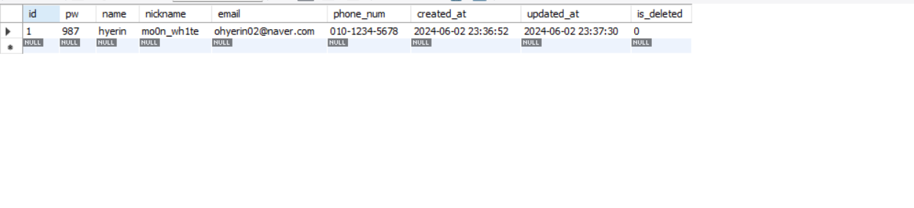
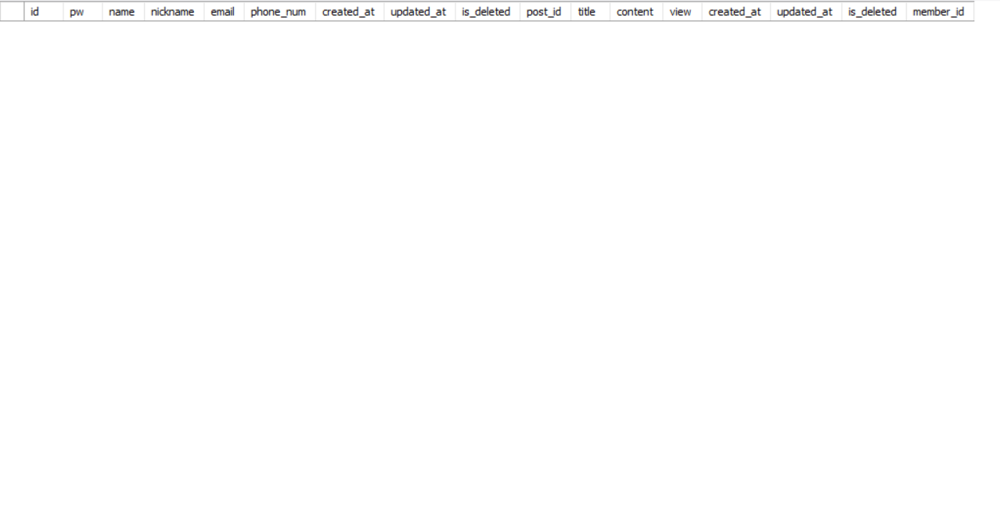
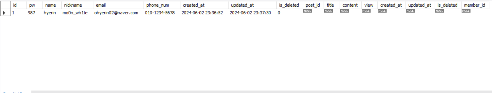
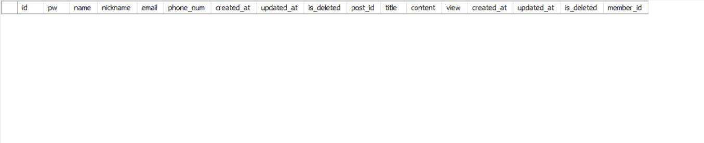
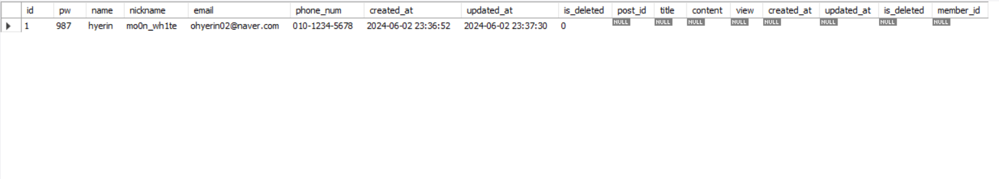

# 5주차
## 데이터베이스-정규화
https://mo0nwh1te.notion.site/f329b6f6a87a4fd08e2a2a3a43e30e67?pvs=4

정규화 이전 파트는 4주차 내용이지만, 같은 데이터베이스 내용이라 하나의 문서로 정리

### 실습 결과

ERD cloud

### CRUD
Create

Read

Update

Delete

### JOIN
데이터를 하나밖에 입력 안해서 비교가 어려움.. 추후 추가 예정

Join-inner

Join-left

Join-right

Join-full
