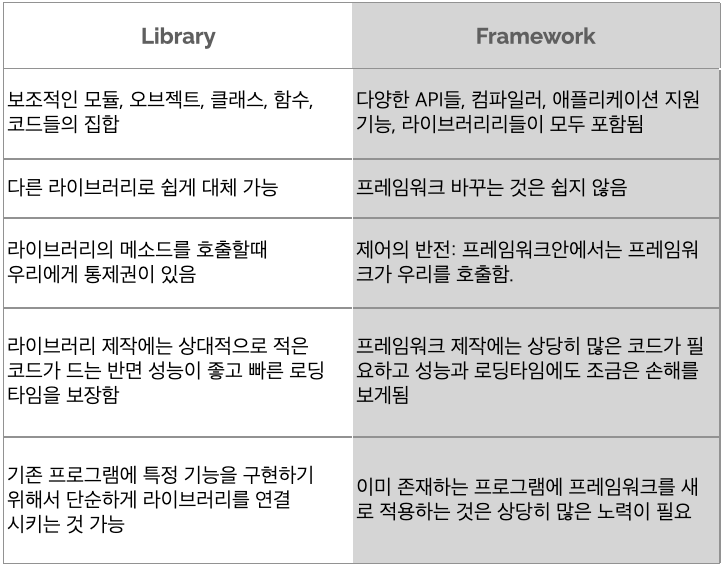
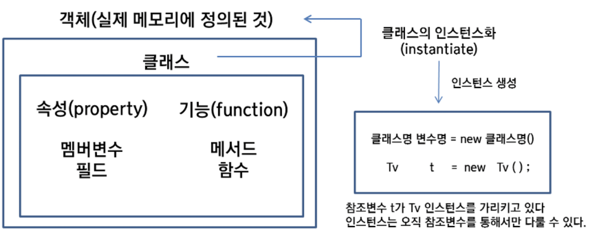
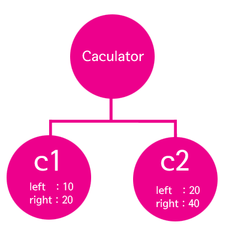

# 2주차 과제
#### (written by. wannagola)

> 라이브러리와 프레임워크

### ✅ 라이브러리(library)?
* <u>라이브러리</u>는 단순 활용가능한 도구들의 집합을 말합니다.
  사전에 미리 작성된 코드 그룹으로 소프트웨어를 개발할 때 컴퓨터 프로그램이 사용하는 비휘발성 자원의 모임이라고 정의할 수 있습니다.

* <u>라이브러리</u>에는 대표적으로 미리 작성된 코드, 변수, 함수, 클래스가 포함됩니다.

* 이해하기 쉽게 설명하면, 라이브러리는(재료)로 개발자(요리사)가 시의적절하게 활용하여 편리하게 요리(코딩)할 수 있게 해줍니다!

* example : 
  * React : 프론트엔드 라이브러리입니다.
  * jQuery : 프론트엔드 개발자사이에서 가장 유명한 라이브러리입니다. 자바스크립트로 쓰여진 작고, 무료이며 오픈소스인 툴킷입니다.
  * STL : C++의 라이브러리
  * Python pip로 설치한 패키지/모듈 (tensorflow, pandas 등)

### ✅ 프레임워크(framework)?
* 애플리케이션의 기본 바탕을 제공해 주면서 개발자들에게 어디를 수정해서 사용해서 쓸지를 알려주는 것이라고 할 수 있습니다. 그래서 프레임워크 자체가 소프트웨어 개발의 업무 흐름을 정의하고 있으며 개발자들에게 무엇이 필요한지 알려주고 필요한 경우 개발자들의 코드를 호출하여 사용하는 구조입니다.

* 프레임워크의 코드에는 완성된 기능들이 포함되지 않는다는 것입니다. 다시 말해, 프레임워크는 애플리케이션의 설계도를 제공하는 프로그램의 골격들이지 완성된 제품은 아니라는 것입니다.

* example : 
  * Angular : 싱글 페이지 애플리케이션을 만들기 위한 프론트엔드 프레임워크입니다.
  * Django : 모델-뷰 템플릿 디자인 패턴을 기반으로 한 파이썬 프레임워크입니다.
  * Spring : Java로 쓰여진 MVC 프레임워크입니다.

### 차이점 비교(특징)
* 라이브러리와 프레임워크간에 존재하는 <u>기술적인 차이</u>는 제어의 반전이라고 불리는 IoC(Inversion of Control)의 개념에 있다. 라이브러리를 사용할때 나는 애플리케이션의 흐름을 제어할 수 있는데 내가 언제 어디서 라이브러리를 호출할 수 있는지 제어 할 수 있다. 프레임워크를 사용할때는 프레임워크 자체가 흐름을 제어한다.

> **스프링 프레임워크 간단히 알아보기**
### JAVA 객체 생성 알아보기
#### 객체 🆚 인스턴스 비교
* 객체와 인스턴스는 크게 차이를 보이지는 않는다. 따라서 두 용어를 혼용하여 사용하기도 한다.

* 하지만, 엄밀히 말하면 <u>**객체**</u>는 모든 인스턴스를 포괄하는 넓은 의미를 가지고, <u>**인스턴스**</u>는 해당 객체가 어떤 클래스로부터 생성된 것인지를 강조한다.

#### **Calculator c1;**
* 그럼 위와 같은 구문은 변수명 c1의 데이터 타입이 무엇이라는 의미일까?

* Calculator라는 의미다. 즉 클래스를 만든다는 것은 사용자 정의 데이터 타입을 만드는 것과 같은 의미다.

 

변수를 다른 말로는 **<u>상태(state)</u>** 라고도 표현한다. c1.sum의 결과는 30, c2.sum의 결과는 60인 것을 통해서 알 수 있듯이 상태가 다른 객체를 대상으로 **<u>메소드</u>** 를 실행시키면 다른 결과를 나타내게 된다. **<u>메소드</u>** 를 다른 말로는 **<u>행동(behave)</u>** 라고도 표현한다.

* 변수 : 상태
* 메소드 : 행동

💡 즉 하나의 클래스를 바탕으로 서로 다른 상태를 가진 인스턴스를 만들면 서로 다른 행동을 하게 된다는 것을 알 수 있다. 하나의 클래스가 여러개의 인스턴스가 될 수 있다는 점이 객체 지향이 제공하는 가장 기본적인 **재활용성**이라고 할 수 있다.

> **싱글톤(Singleton) 패턴** 
### 객체가 무한히 생성되었을 때 발생할 수 있는 문제점
1. **메모리 소모**: 객체는 생성될 때마다 시스템의 메모리를 소모합니다. 객체가 무제한으로 생성되면 사용 가능한 메모리가 급격히 감소하게 되고, 이는 메모리 부족(out of memory) 상태로 이어질 수 있습니다. 메모리 부족 상태는 시스템이나 애플리케이션의 성능 저하, 실패 또는 크래시를 초래할 수 있습니다.

2. **성능 저하**: 객체를 생성, 관리, 추적하는 데 CPU 시간과 시스템 자원이 소모됩니다. 무제한의 객체 생성은 CPU 부하를 증가시키고, 시스템의 전반적인 성능 저하를 초래할 수 있습니다. 특히, 객체 간의 상호 작용이 복잡해질수록 이 문제는 더욱 심화됩니다.

3. **가비지 컬렉션(Garbage Collection) 오버헤드**: 자바와 같은 언어에서는 가비지 컬렉터가 더 이상 사용되지 않는 객체를 자동으로 청소합니다. 하지만 객체가 과도하게 생성될 경우, 가비지 컬렉터가 자주 실행되어 성능에 부정적인 영향을 미칠 수 있습니다. 가비지 컬렉션 동안에는 정상적인 애플리케이션 처리가 일시적으로 중단되기도 합니다.

4. **리소스 누수**: 객체가 제대로 해제되지 않고 계속해서 메모리를 차지하는 상황, 즉 메모리 누수도 발생할 수 있습니다. 이는 장기적으로 애플리케이션의 안정성을 해치고, 결국 시스템의 장애로 이어질 수 있습니다.

5. **관리 및 유지보수의 어려움**: 객체가 과도하게 많아지면 코드의 복잡성이 증가하고, 이로 인해 버그 발생 가능성이 높아지며, 코드의 이해와 유지보수가 어려워집니다. 이는 개발 과정에서 시간과 비용을 증가시키는 원인이 됩니다.

### ✅ 싱글톤(Singleton) 패턴이란?

- 싱글톤 패턴은 특정 클래스의 인스턴스를 1개만 생성되는 것을 보장하는 디자인 패턴이다. 즉, 생성자를 통해서 여러 번 호출이 되더라도 인스턴스를 새로 생성하지 않고 최초 호출 시에 만들어두었던 인스턴스를 재활용하는 패턴이다.

### 싱글톤 패턴을 사용하는 이유?
- 싱글톤 패턴을 사용함으로써 얻을 수 있는 이점 중 하나는 메모리 낭비를 방지할 수 있다.

- 사용자가 1초에 10번 똑같은 요청을 보내면 요청을 처리하기 위한 똑같은 객체를 1초에 10번 생성하고 소멸되는 메모리 낭비 문제가 발생하게 된다.
하지만 싱글톤 패턴을 사용하면 최초 한번 new로 객체를 생성하고 해당 객체를 이후에도 사용하도록 공유(static)하면 메모리 낭비 문제를 방지할 수 있다.

> **왜 스프링(Spring)을 사용할까?**

> 스프링 빈과 스프링 컨테이너
#### ✅ 스프링 빈(Spring Bin)
| Keyword          |Description|
|------------------|--|
| 스프링 빈(Spring Bin)|스프링(Spring) 컨테이너가 관리하는 자바 객체|
| 스프링 컨테이너(Spring Container) |스프링 컨테이너는 스프링 빈의 생명 주기를 관리하며, 생성된 스프링 빈들에게 추가적인 기능을 제공하는 역할을 한다. IoC와 DI의 원리가 스프링 컨테이너에 적용된다. 개발자는 new 연산자, 인터페이스 호출, 팩토리 호출 방식으로 객체를 생성하고 소멸하지만, 스프링 컨테이너를 사용하면 해당 역할을 대신해 준다. 즉, 제어 흐름을 외부에서 관리하게 된다. 또한, 객체들 간의 의존 관계를 스프링 컨테이너가 런타임 과정에서 알아서 만들어 준다.
|

> **제어의 역전(Inversion of Control, IoC)**

### ✅ 제어의역전(IoC)의 기본 개념
- 전통적인 프로그래밍에서는 애플리케이션의 흐름을 프로그래머가 직접 제어합니다. 예를 들어, 메인 함수에서 여러 함수를 호출하며 필요한 객체를 생성하고, 의존성을 직접 관리합니다. 반면, IoC를 사용하면 이러한 제어 권한이 애플리케이션 코드에서 프레임워크나 라이브러리로 이전됩니다. 즉, 어떤 객체가 언제 생성되고, 어떻게 서로 연결될지를 외부의 제어자가 결정하고 관리합니다.

### 제어의역전(IoC)의 주요 이점
| 이점                                                       |Description|
|----------------------------------------------------------|--|
| 결합도 감소|컴포넌트 간의 의존성이 감소하여 각 컴포넌트를 독립적으로 개발하고 테스트할 수 있습니다. |
|코드 재사용 증가|공통의 제어 로직이 프레임워크에 의해 처리되므로, 사용자는 비즈니스 로직에 더 집중할 수 있고 코드 재사용성이 향상됩니다.|
|유지 보수성 향상|컴포넌트 사이의 느슨한 결합 덕분에 시스템의 일부를 수정하거나 업데이트하는 것이 훨씬 쉬워집니다.|
|유연성 및 확장성|새로운 컴포넌트를 쉽게 추가하거나 교체할 수 있어, 애플리케이션의 유연성과 확장성이 증가합니다.|

### 제어의역전(IoC) 구현 방법
|방법|Description|
|--|--|
|의존성 주입(Dependency Injection, DI)|객체의 의존성을 외부에서 주입하는 방법으로, 가장 일반적인 IoC의 형태입니다. 객체는 필요한 의존성을 직접 생성하지 않고, 생성자, 세터 메서드 또는 필드를 통해 주입받습니다.|
|이벤트 기반 프로그래밍|이벤트를 사용하여 애플리케이션의 흐름을 제어하고, 이벤트 발생 시 콜백 함수나 이벤트 핸들러를 실행합니다.|
|프레임워크에 의한 제어|스프링 프레임워크(Spring Framework)와 같은 고급 프레임워크를 사용하여 애플리케이션의 생명주기와 구성 요소의 생성 및 관리를 위임합니다.|
