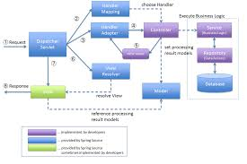

## 디자인 패턴: MVC 패턴 이해하기

## 📕 [기본] MVC 패턴이란?
비즈니스 로직과 화면을 구분하는데 중점을 맞춘 디자인 패턴의 한 종류
로직과 화면의 분리는 **관심사 분리**로 관리의 용이성을 제공한다.

3. 컨트롤러 : 모델과 뷰로 명령을 전달
어떤 요청이 컨트롤러로 들어오면 컨트롤러는 모델과 뷰로 명령을 전달함
모델은 뷰에서 활용되는 데이터를 다룸
뷰는 앞의 과정의 결과를 보여줌

## 📕 [기본] `Model` 에 대해 알아보기
데이터와 비즈니스 로직을 관리
ex) 회원정보, 장바구니
## 📕 [기본] `View` 에 대해 알아보기
레이아웃과 화면을 처리
ex) 웹 페이지
## 📕 [기본] `Controller` 에 대해 알아보기
클라이언트의 요청을 분서하여 적절한 비즈니스를 수행하고
모델과 뷰로 명령을 전달

# Spring Boot 에 대한 이해
## 📕 [기본] 기존의 `Spring` 의 설정 측면에서 단점 알아보기
## 📕 [기본] `Spring Boot` 가 제공하는 장점 알아보기

1. **설정의 복잡성** : 
기존 스프링 프레임워크는 XML 기반 설정이나 어노테이션을 활용해야 하는데,
프로젝트 초기에 많은 노력이 요구된다.
스프링 부트는 auto configuration 과 starter pack 을 제공하여 
초기 설정의 복잡성을 해결했다.
2. **의존성 관리** :
스프링 프로젝트는 라이브러리의 버전을 일일이 관리해야 한다.
이렇게 되면 프로젝트가 커질 때 관리가 어려워지는 문제를 야기한다.
스프링 부트는 스타터 팩을 통해서 이런 의존성을 단순화한다. 
마약 스프링 부트가 아니라면 라이브러리를 직접 설치해야하는 불편함을 겪게 된다.
3. **배포의 복잡성** : 
기존 스프링은 WAR 파일로 패키징하여 웹 서버에 배포한다.
하지만 스프링 부트는 내장 서버를 제공함으로써 개발자가 별도의 웹 서버를 구축하지 않고도 웹 서버를 쉽게 배포할 수 있다.
또한 스프링 부트에서는 JAR 파일로 패키징하여 실행할 수 있어서 배포 과정이 간소화된다.
JAR 파일은 WAR 파일과 다르게 내장 서버를 포함하므로 별도의 웹 서버가 필요 없는 형태이다.
반면 WAR 형태는 다른 서버에 의존적이다.
4. **개발 속도** :
스프링만으로는 자세한 동작을 설정할 수 있지만 개발속도를 늦추는 문제가 있다.
스프링 부트는 이를 개선하기위해 빠르게 프로토타입을 만들고 애플리케이션을 개발할 수 있도록 도와준다.

# 로깅에 대한 이해
## 📕 [기본] 로깅(Logging)이란?
`System.out.println()` 과 `로깅`을 통해서 확인하는 방법의 차이를 중심으로 알아보세요.
애플리케이션의 동작 과정을 추적하기 위해 기록하는 것을 로깅이라 한다.
기존 println 은 표준출력으로 출력되기 때문에 별도로 저장할 수 없다.
또한 부하가 있기 때문에 여러번 사용하면 시스템에 영향을 끼친다.
예를 들어 코딩 테스트에서 for 문에 print 문을 넣을 경우 메모리와 시간면에서 부하가 있음을 할 수 있다.
그래서 logger 를 사용해서 기록을 관리하는게 용이하다.

## 📕 [기본] `@Slf4j` 애노테이션 알아보기
로깅 추상화 라이브러리로 로깅 시스템에 의존성을 낮춘 형태이다.
덕분에 해당 라이브러리로 로깅을 하면 다른 로깅 라이브러리로 변경이 용이하다.

## Spring MVC 프레임워크 알아보기

## 📕 [기본] Spring MVC 의 요청 처리 플로우에 대해 이해해보기

1. 클라이언트가 HTTP 요청을 보냄
2. DispatcherServlet 이 요청을 받아들임
3. HandlerMapping 에게 요청 URL 에 매핑된 핸들러를 물어봄
4. Controller 비즈니스 로직을 처리하고, 모델과 뷰 이름을 반환함
5. ViewResolver 가 뷰 이름을 실제 뷰 객체로 변환함
6. View 에 모델 데이터를 사용하여 뷰를 렌더링 함
7. 최종 HTML 을 클라이언트에게 반환 함
 
## 📕 [기본] `@Controller` 애노테이션 알아보기
웹 요청과 응답을 처리하는 컨트롤러 클래스를 정의함
MVC 패턴의 Controller 역할을 수행함
반환값은 String 타입이며 .html 접미사를 붙여 해당하는 페이지와 연결함

@RestController 는 반환값을 HttpResponseBody 에 담아서 반환하도록함 
어노테이션 내부를 보면 @ResponseBody 와 @Controller 가 포함되어 있음.

## 📕 [기본] `@Service` 애노테이션 알아보기
비즈니스 로직을 정의할 때 사용함
트랜잭션 관리를 적용한 비즈니스 로직의 실행을 담당함

## 📕 [기본] `@Repository` 애노테이션 알아보기
데이터 접근 계층의 클래스를 정의할 때 사용하며
JpaRepository 인터페이스를 상속받는 레포지토리 인터페이스를 정의하면
스프링 데이터 JPA 에서 구현체를 생성해준다.