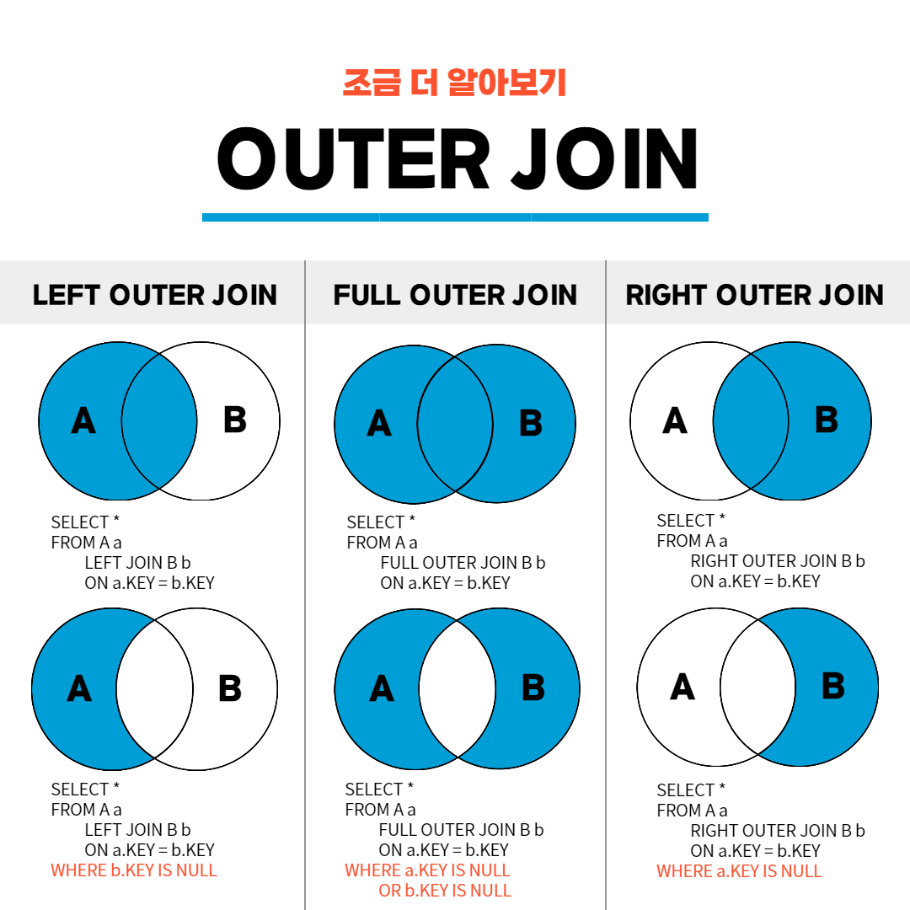
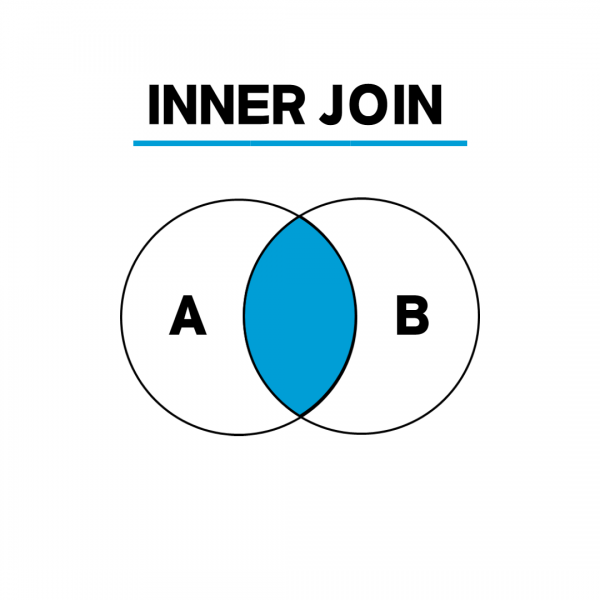
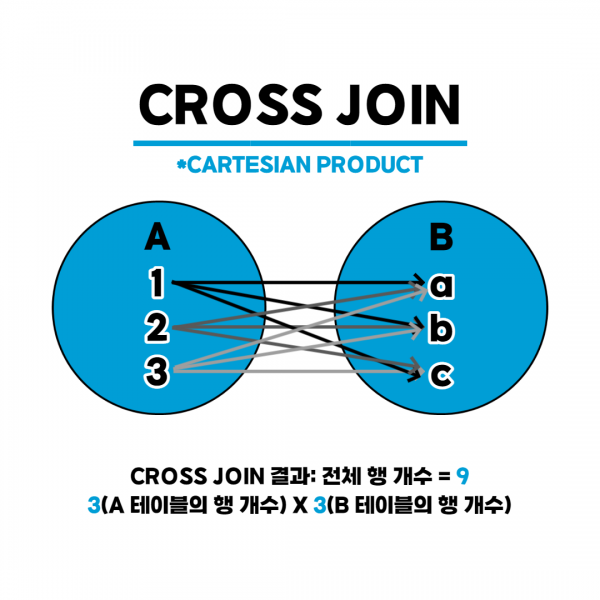

## 정규화

### 📕 [기본] 정규화의 목적과 중요성 알아보기

RDBMS 의 테이블 설계에서 중복을 최소화는 작업이다.
다음 데이터를 예로 들어보자.

| 학번 | 수강코드 | 이름  | 강사코드 |
|----|------|-----|------|
| 1  | 200  | 나병우 | 300  |
| 2  | 200  | 김나연 | 300  |
| 2  | 300  | 김나연 | 400  |

위 테이블을 보자.
수강코드와 강사코드가 대응하는 점을 볼 수 있다.
이는 중복이라 볼 수 있다.
그럼 중복을 제거해 보자.

| 학번 | 수강코드 | 이름  |
|----|------|-----|
| 1  | 200  | 나병우 |
| 2  | 200  | 김나연 |
| 2  | 300  | 김나연 |

| 수강코드 | 강사코드 |
|------|------|
| 200  | 300  |
| 300  | 400  |

위와 같이 두 테이블로 분리된 것을 알 수 있다.
단순하게 보자면 한 테이블에서 정규화를 통해 25% 물리적 공간을 확보한 것이라 볼 수 있다.
그리고 기존에는 강사코드가 변경되면 컬럼 전체를 조회하면서 변경해야 했다면,
이제는 정규화된 작은 테이블에서 값을 조정하기만 하면 된다.

이처럼 정규화는 데이터베이스의 CRUD 동작을 효율적으로 이루어질 수 있게 한다고 생각하면 된다.
또한 여러가지 관점에서 정규화의 종류가 나뉜다.

### 📕 [기본] 정규화의 종류 알아보기 (1NF, 2NF, 3NF, BCNF)

1. 1NF
   도메인이 원자값을 가져야 한다.
   원자값이란 더 이상 논리적으로 분해될 수 없는 값을 의미한다.

| 수강과목 | 수강자       |
|------|-----------|
| 수학   | 홍길동       |
| 과학   | 임꺽정, 신사임당 |

위 테이블의 경우 수강자 컬럼은 논리적으로 분해할 수 있다.
그러므로 정규화를 실시해야 한다.
그러면 이를 개선해보자.

| 수강과목 | 수강자  |
|------|------|
| 수학   | 홍길동  |
| 과학   | 임꺽정  |
| 과학   | 신사임당 |

2. 2NF

부분적 함수 종속을 제거한다.
우선 부분적 함수 종속을 제거한다는 말은, 완전 함수 종속이 되도록 한다는 말이다.
함수 종속은
그럼 종속 관계는 뭘까?

| 학번   | 이름   | 소속학과 | 학과장 |
|------|------|------|-----|
| 1901 | 홍길동  | 컴퓨터과 | 김교수 |
| 1845 | 임꺽정  | 전자과  | 박교수 |
| 1706 | 신사임당 | 기계과  | 천교수 |
| 1925 | 장영실  | 컴퓨터과 | 김교수 |

위 테이블을 보면 학번은 이름 + 소속 + 학과장과 종속 관계이다.
여기서 소속학과별 학과장의 이름은 중복되지 않는다는 가정이 붙는다.
그렇다면 학과장은 소속학과에 종속된다.
이를 부분종속이라 한다
즉 학과장 컬럼이 굳이 이 테이블에 있을 필요가 없고, 김교수라는 이름이 중복되어서 기입된다.

이를 해결해보자.

| 학번   | 이름   | 소속학과 |
|------|------|------|
| 1901 | 홍길동  | 컴퓨터과 |
| 1845 | 임꺽정  | 전자과  |
| 1706 | 신사임당 | 기계과  |
| 1925 | 장영실  | 컴퓨터과 |

| 이름   | 학과장 |
|------|-----|
| 홍길동  | 김교수 |
| 임꺽정  | 박교수 |
| 신사임당 | 천교수 |
| 장영실  | 김교수 |

이처럼 두 테이블로 분리하면 학과장의 이름을 중복해서 다루지 않을 수 있다.

3. 3NF

이행적 함수 종속을 제거해야 한다.
이행적 함수 종속은 A->B 이고 B->C 일 때 A->C 인 관계

| 학번   | 이름   | 소속학과 | 대학 |
|------|------|------|----|
| 1901 | 홍길동  | 컴퓨터과 | 공대 |
| 1845 | 임꺽정  | 전자과  | 공대 |
| 1706 | 신사임당 | 경제   | 경상 |
| 1925 | 장영실  | 경영   | 경상 |

위 테이블에서 소속학과는 특정 대학에 속한다.
이는 대학이 소속학과에 종속됨을 의미한다.
홍길동 -> 컴퓨터과이고 컴퓨터과->공대일 때, 홍길동->공대인 관계가 성립한다.

이러면 컴퓨터과 학생을 추가할 때 대학 정보도 같이 삽입되어야 하는 불편함을 가진다.
컴퓨터과의 대학이 IT 대학으로 변경되면, 모든 정보를 변경해야 한다.
홍길동이라는 학생을 삭제할 때, 컴퓨터과의 대학 정보가 사라진다.

개선해보자.

| 학번   | 이름   | 소속학과 |
|------|------|------|
| 1901 | 홍길동  | 컴퓨터과 |
| 1845 | 임꺽정  | 전자과  |
| 1706 | 신사임당 | 경제   |
| 1925 | 장영실  | 경영   |

| 소속학과 | 대학 |
|------|----|
| 컴퓨터과 | 공대 |
| 전자과  | 공대 |
| 경제   | 경상 |
| 경영   | 경상 |

4. BCNF

결정자이면서 후보 키가 아닌 속성을 제거해야 한다.
후보 키는 각 행을 유일하게 식별할 수 있는 최소한의 속성 집합이다.

| 학생번호 | 과목     | 지도교수 |
|------|--------|------|
| 101  | Java   | 김영우  |
| 101  | C      | 이수안  |
| 102  | Python | 김수민  |
| 103  | Ruby   | 홍길동  |
| 104  | C#     | 박민수  |

위 테이블을 보면 (학생번호, 과목) 이 후보 키가 된다.
모순되게도 지도교수를 알면 과목을 알 수 있는 관계가 된다.
(학생번호, 과목)->지도교수, 지도교수 -> 과목

해결해보자.

| 학생번호 | 지도교수 |
|------|------|
| 101  | 김영우  |
| 101  | 이수안  |
| 102  | 김수민  |
| 103  | 홍길동  |
| 104  | 박민수  |

| 지도교수 | 과목     |
|------|--------|
| 김영우  | Java   |
| 이수안  | C      |
| 김수민  | Python |
| 홍길동  | Ruby   |
| 박민수  | C#     |

이처럼 학생->지도교수->과목 의 종속관계를 알 수 있다.

### 📕 [기본] 반정규화 알아보기

정규화 과정을 거꾸로 적용하는 작업.
데이터 무결성이 깨지는 문제가 있지만, 데이터 조회의 효율을 높이기 위해서 사용됨.

### 📕 [기본] 외래키(FK)와 연관 관계

#### 📕 [기본] 외래키(FK) 의 정의와 역할

한 테이블의 컬럼 중 다른 테이블의 행을 식별할 수 있는 키이다.
이전 정규화에서 BCNF 를 참고하면 학생별 지도교수 테이블에서 지도교수 컬럼은 지도교수별 과목 테이블을 식벽할 수 있으므로 외래키가 된다.

#### 📕 [기본] 외래키 설정 방법 및 주의점

- 📕 [기본] 일대일(1 : 1), 다대일(N : 1), 다대다(N : M) 관계의 이해

1. 일대일(1 : 1)

한 컬럼의 한 데이터가 다른 테이블의 컬럼과 하나의 연결을 가지는 경우

2. 다대일(N : 1)

한 컬럼이 한 데이터가 다른 테이블의 컬럼과 여러 개의 연결을 가지는 경우

3. 다대다(N : M)

한 컬럼의 여러 데이터가 다른 테이블의 컬럼과 여러 개의 연결을 가지는 경우

### 📕 [기본] CRUD 와 조인

- **CRUD 기본**
    - 📕 [기본] 등록(Create), 조회(Read), 수정(Update), 삭제(Delete)의 이해

#### 📕 [기본] INNER JOIN, LEFT JOIN, RIGHT JOIN, FULL JOIN 의 이해

1. INNER JOIN(기본 조인), 교집합
   두 테이블에 모두 지정한 열의 데이터가 있어야 하는 것  
   = 특정 컬럼이 겹치는 것을 조회
   기본 조인이라는 이유는 INNER JOIN 대신 JOIN 만 사용해도 되기 때문
   

2. OUTER JOIN(Left, RIGHT, FULL)
   한 테이블에만 데이터가 있어도 병합됨

- LEFT OUTER JOIN : 왼쪽 테이블의 모든 값이 출력되는 조인
- RIGHT OUTER JOIN : 오른쪽 테이블의 모든 값이 출력되는 조인
- FULL OUTER JOIN : 왼쪽 또는 오른쪽 테이블의 모든 값이 출력되는 조인
  

3. CROSS JOIN(상호 조인)
   한쪽 테이블의 모든
   
