# 1주차 과제 
#### (written by. wannagola)

> 클라이언트(client)와 서버(server)

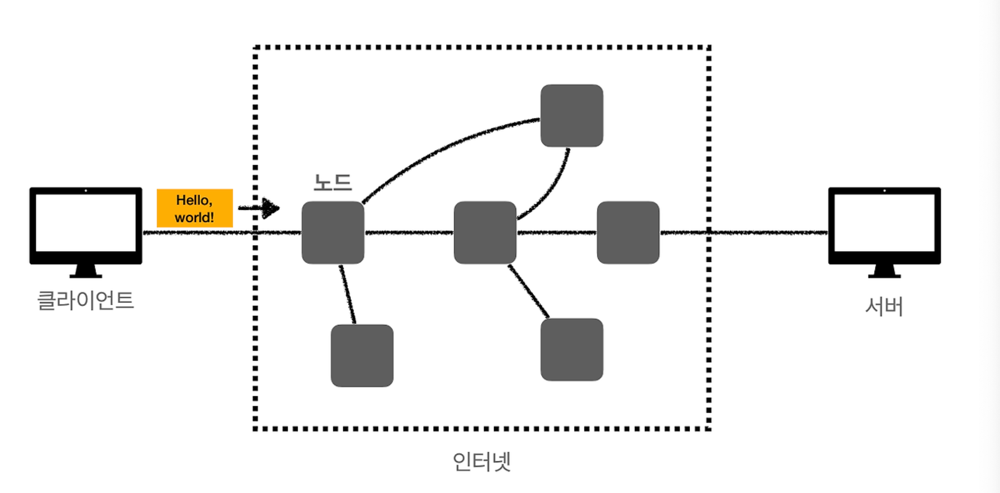

| keyword | Description                                                                                                                                                                           |
|--|---------------------------------------------------------------------------------------------------------------------------------------------------------------------------------------|
|클라이언트| 서버에서 받은 서비스를 사용하는 사용자로, 크게 장치 또는 프로그램이 될 수 있다. 클라이언트 장치는 최종 사용자가 웹에 접속하는데 사용하는 시스템으로 데스크톱, 노트북, 스마트폰, 태블릿 등을 예로 들 수 있다. 클라이언트 프로그램은 사용자가 웹을 통해 요청할 수 있게 해주는 프로그램으로 웹 브라우저를 예로 들 수 있다. |
|서버|일반적으로 클라이언트의 요청에 대해 응답해주는 시스템으로, 간단하게 무엇을 제공해 주는 입장이라고 생각하면 된다. 우리가 컴퓨터를 할 때 일반적으로 웹 브라우저를 통해 정보를 볼 수 있는데 이것은 서버로 부터 정보를 받아 우리가 볼 수 있는 것이다.|

> 인터넷 통신 방법

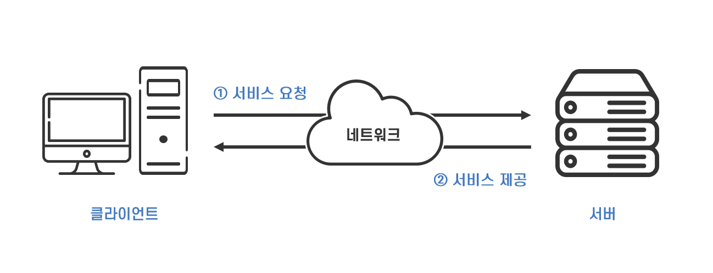

<!--Table-->
|Keyword|Description|
|--|--|
|**IP 주소**|컴퓨터는 고유한 IP 주소를 갖고 있어서, 인터넷 상에서 서로를 식별한다.|
|**도메인 네임 시스템(DNS)** |도메인 이름을 사용해서 사람이 주소를 쉽게 기억할 수 있도록 하고, 이 이름을 컴퓨터가 이해할 수 있는 IP 주소로 바꿔준다.|
|**통신 프로토콜** |데이터를 주고받기 위한 규칙과 형식을 정한 것인데, 대표적으로 TCP/IP가 있다.|
|**데이터 패킷** |전송하려는 데이터는 패킷이라고 하는 작은 조각으로 나눠서 인터넷을 통해 보내진다. 각 패킷엔 목적지와 출발지 주소, 데이터 조각의 순서 등이 들어있다.|
|**라우팅** |데이터 패킷은 여러 라우터를 거쳐 목적지로 간다. 라우터는 패킷이 도착할 최적의 경로를 계산해서 보내준다.|
|**TCP 연결** |데이터가 정확히 도착했는지 확인한다. 연결 설정에서부터 데이터 전송 후 수신 확인과 오류 검사까지 포함된다.|
|**포트 번호** |특정 서비스는 특정 포트 번호를 사용한다. 이를 통해 한 컴퓨터가 동시에 여러 네트워크 서비스를 제공할 수 있다.|
|**HTTP/HTTPS** |웹 페이지에 접속할 때 쓰이는 프로토콜이다. HTTPS는 HTTP에 보안 기능을 추가한 것이다.|

 
> IP
인터넷 통신

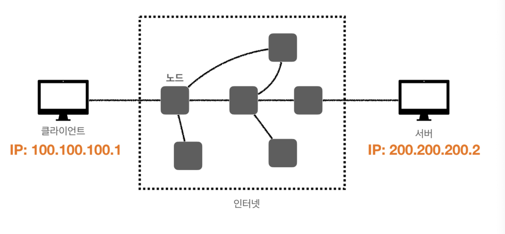
### IP의 역할

- 지정한 IP 주소에 데이터 전달
- 패킷이라는 통신 단위로 데이터 전달

클라이언트에게 IP 주소, 서버에게도 IP 주소가 있어야 하고, 서버에게 메시지를 보낼 때 최소한의 규칙이있어야 보낼 수 있는데 패킷이라는 단위로 전송된다. 규칙을 잘 지켜서 패킷을 잘 구성하여야 한다.
> **패킷** - 헤더와 페이로드로 구성되며, 헤더에는 출발지 IP 주소와 목적지 IP 주소 등의 정보가 포함된다.
### IP의 역할

- 지정한 IP 주소에 데이터 전달
- 패킷이라는 통신 단위로 데이터 전달

클라이언트에게 IP 주소, 서버에게도 IP 주소가 있어야 하고, 서버에게 메시지를 보낼 때 최소한의 규칙이있어야 보낼 수 있는데 패킷이라는 단위로 전송된다. 규칙을 잘 지켜서 패킷을 잘 구성하여야 한다.

> **패킷 -** 헤더와 페이로드로 구성되며, 헤더에는 출발지 IP 주소와 목적지 IP 주소 등의 정보가 포함된다.

|keyword| Description                                                                                                     |
|--|-----------------------------------------------------------------------------------------------------------------|
|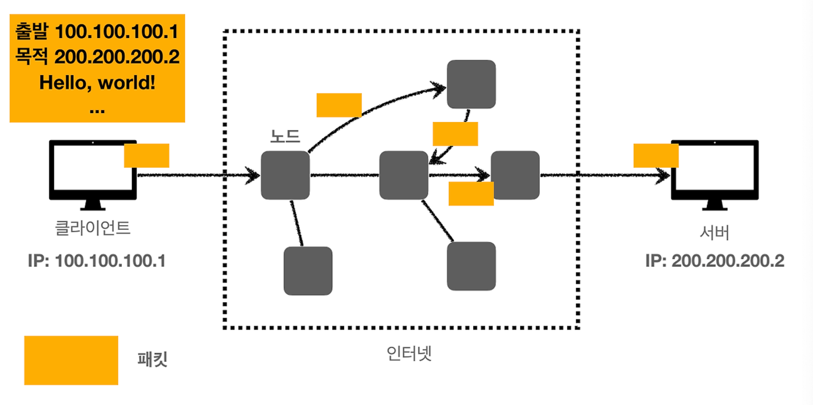| **클라이언트  패킷 전달** : 클라이언트에서 패킷을 규칙에 맞게 만들어 전송하게 되면, 전송된 패킷을 인터넷망의 노드들에서 해석해가면서 도착지 IP주소인 200.200.200.2에 도착하게 된다. |
|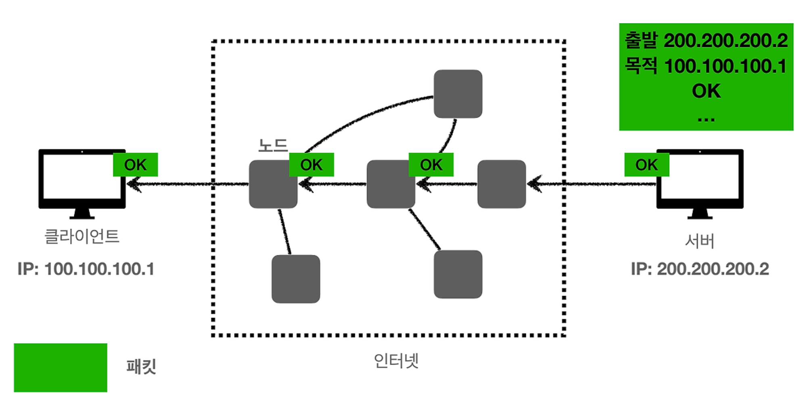| **서버 패킷 전달** : 서버도 클라이언트와 마찬가지로 패킷에 새로운 메시지와 여러 정보들을 넣고 전달하게 된다.                                                |

> IP 프로토콜의 한계점

1. 비연결성
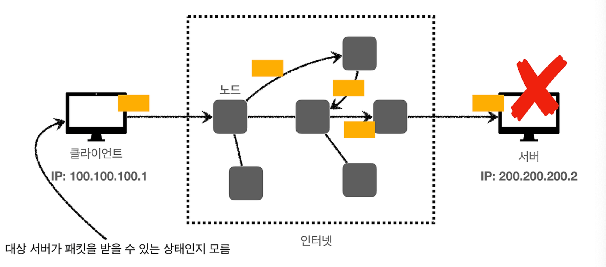
   1. 서버나 클라이언트는 서버가 꺼져있는지, 클라이언트가 꺼져있는지 알 수가 없다. 
   따라서 패킷을 받을 대상이 없거나 서비스 불능 상태여도 패킷은 계속 전송된다는 한계가 있다.
--------
2. 비신뢰성
   1. 만약 패킷을 전달하는 서버 중 하나가 문제가 생긴다면 패킷 유실이 일어날 것이다.
   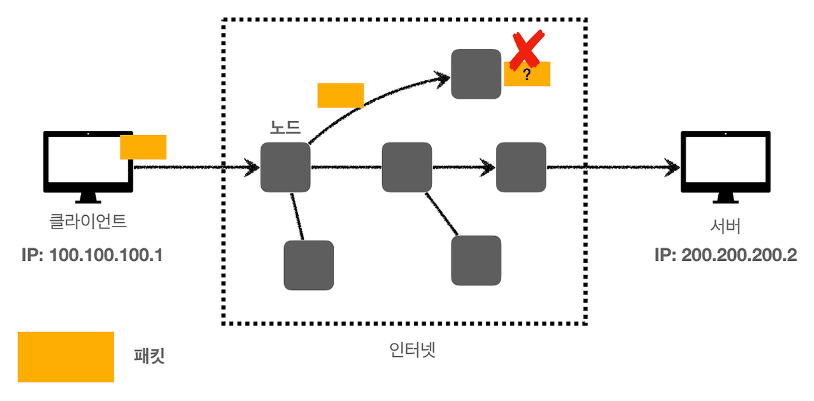
   2. 패킷은 보통 한번에 전달 될때 1500byte 정도의 크기로 나누어져서 보내게 되는데, 큰 파일의 경우 나누어 보내지게 되는데, 이 때 나누어진 패킷이 보낸 순서와 도착 순서가 다르다면 받은 정보를 신뢰할 수 없을 것이다.
        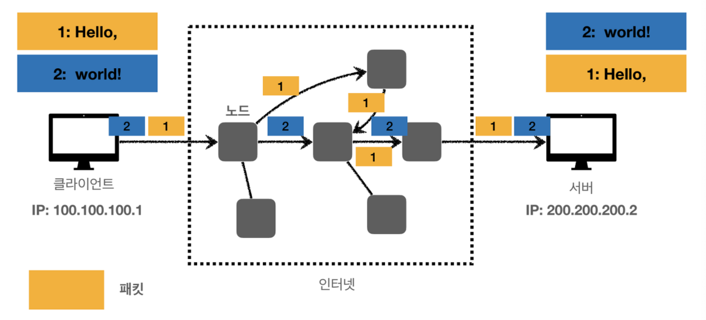

--------
3. 같은 IP 내에 프로그램 구분 불가
   1. 같은 IP 를 사용하는 서버에서 통신하는 어플리케이션이 둘 이상이라면 이 두 어플리케이션이 구분 되지 않는 다는 한계가 있다.

> **TCP** (Transmission Control Protocol : 전송 제어 프로토콜)

### 인터넷 프로토콜 스택에는 4계층이 존재한다.
1. 어플리케이션 계층(Data) - HTTP, FTP, SSH, SMTP
2. 전송 계층(Segment) - TCP, UDP
3. 인터넷 계층(Packet) - IP
4. 네트워크 인터페이스 계층(Frame) - LAN 드라이버, LAN 장비 등등
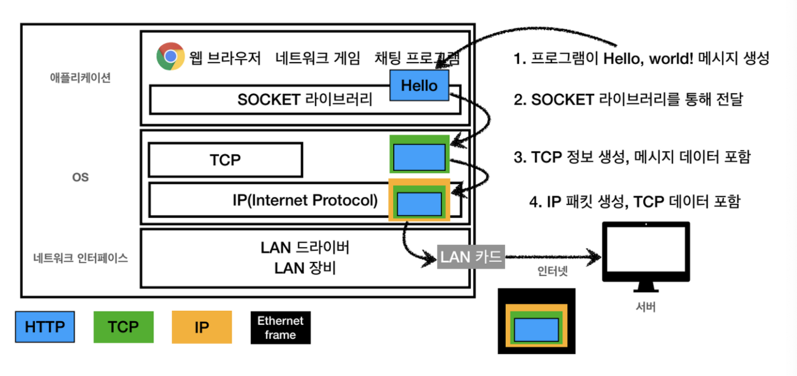
- IP 프로토콜에서 중간에 패킷이 소실되고 순서를 구별할 수 없는 여러 한계들을 TCP 라는  프로토콜이 해결해준다. 

> **TCP/IP**

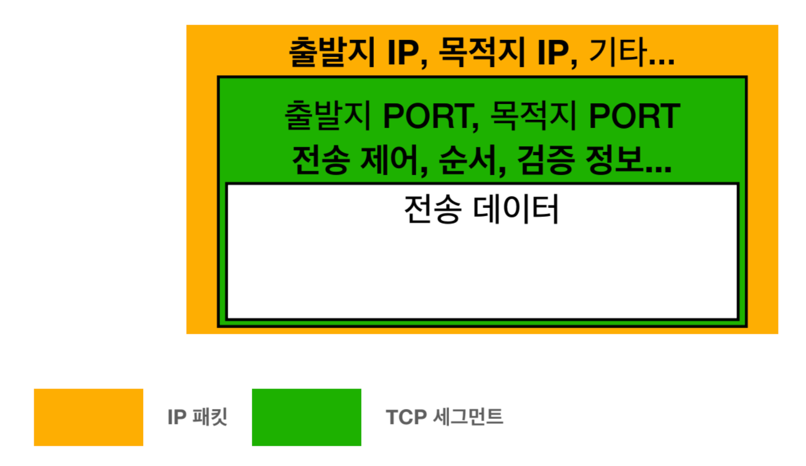

1. TCP와 관련된 정보인 TCP세그먼트는 출발지 포트, 목적지 포트, 전송제어, 순서, 검증 정보 등등이 포함된다.
2. IP프로토콜에서 해결이 되지 않는 순서제어 문제가 TCP 프로토콜에서는 해결이 되는 것이다.
--------
### TCP의 특징
 **TCP 3 way handshake (가상연결)**
  - IP 프로토콜의 비연결성을 극복하기 위해 Tcp에서는 통신을 시작하기 전 연결을 설정하고 신뢰성 있는 통신을 하기 위해 3 way handshake 라는 과정을 진행한다.
  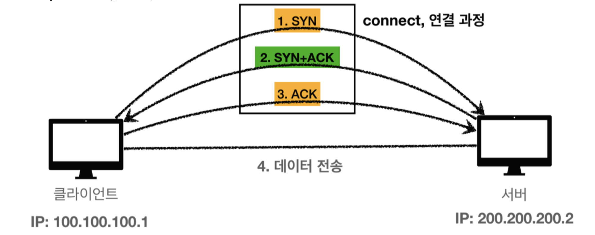

    |Keyword|Description|
    |--|--|
    |SYN(synchronize)|접속 요청|
    |ACK(acknowledge)|요청 수락|

    | 순서 | Description                                                        |
    |----|--------------------------------------------------------------------|
    | 1  | 클라이언트에서 먼저 SYN 메시지를 서버에게 접속을 허락해달라고 요청한다.                          |
    | 2  | 서버는 접속을 수락하고  ACK 메시지를 클라이언트에게 전송할 때 서버의 접속을 요구하는 SYN메시지와 함께 전송한다. |
    | 3  | 클라이언트가 접속을 수락하면 서버에게 ACK 메시지를 전송한다.                                |
    | 4  | 연결이 되면 데이터 전송을 시작한다.                                               |
--------
**데이터 전달 보증**

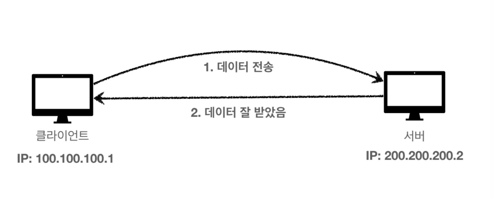

- 데이터를 전송한 측에서 데이터를 수신한 측으로 데이터 패킷을 전송하면, 수신 측은 이를 확인하는 ACK 메시지를 송신 측으로 전송한다. 이 ACK 메시지는 송신 측에게 데이터가 정확하게 전송되었음을 알려준다. 만약 송신 측이 ACK를 받지 못하면, 데이터가 손실되었을 가능성이 있으므로 다시 전송을 시도한다.
--------
**순서 보장**
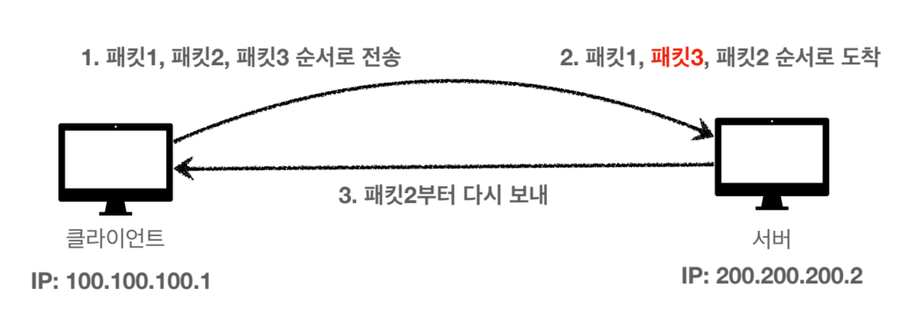
- 메시지의 크기, 즉 패킷의 용량이 커지면 패킷을 쪼개어 순서대로 나눠서 보내게 된다. 만약 서버에 1번, 3번, 2번 순서도 패킷이 도착한다면 다시 순서에 맞게 전송하도록 요구한다. TCP 세그먼트 내부에 전송제어, 순서, 검증정보가 있기에 가능하다.

--------
💡 알아두면 좋을 프로토콜 **UDP : User Datagram Protocol : 사용자 데이터그램 프로토콜

--------
* tcp는 전송해야할 정보도 많고, 3handShake때문에 전송속도가 느린 반면  UDP는 이러한 절차가 없기 때문에 상대적으로 전송속도가 빠르다. 따라서 대용량 파일을 전송할 때 주로 사용된다.

  * TCP 3HandShake X
  * 데이터 전달 보증 X
  * 순서 보장 X
--------
만약 하나의 클라이언트에서 서버에 두 종류 이상의 메시지를 보내야 하는 상황이 온다면,
하나의 IP주소로만 통신을 하기에는 무리가 있을 것이다.
따라서 이를 해결하기 위해 **PORT**를 사용한다.

> **Port**
### 포트의 정의
* 포트는 컴퓨터 네트워킹에서 매우 중요한 개념으로, 네트워크를 통해 데이터를 주고받는 과정에서 특정 프로세스나 서비스에 데이터를 전달하기 위한 논리적인 접점을 말한다. 간단히 말해, 컴퓨터의 IP 주소가 주소지라면, 포트는 그 안의 특정한 '문'과 같다고 볼 수 있다.
--------
### 포트의 주요 기능
* 데이터 라우팅: 네트워크를 통해 전송된 데이터가 특정 프로그램이나 서비스에 정확히 도달하도록 돕는다. 예를 들어, 웹 서버는 일반적으로 포트 80(HTTP) 또는 443(HTTPS)을 사용하여 웹 페이지 요청을 받는다.

* 멀티태스킹: 하나의 컴퓨터에서 여러 네트워크 서비스를 동시에 제공할 수 있게 한다. 각 서비스는 고유한 포트 번호를 사용하여 동시에 여러 연결을 관리할 수 있다.

* 포트 번호 : 0부터 65535까지 할당될 수 있는데, 이 중 특정 범위의 번호는 특정 서비스에 사전에 할당되어 일반적으로 사용된다.
--------
### 포트 종류
|구분|Description|
|--|--|
| 잘 알려진 포트(Well-known ports) |0~1023번까지이며, 특정 서비스가 표준 포트로 사용한다. 예를 들어 HTTP는 80, HTTPS는 443, FTP는 21.|
| 등록된 포트(Registered ports)  |1024~49151번까지이며, 사용자나 회사가 서버 서비스에 대해 등록하여 사용할 수 있다.|
|동적/사설 포트(Private/dynamic ports)|49152~65535번까지이며, 일시적인 통신을 위해 자동으로 할당되는 포트다.|

--------
- 포트는 TCP(Transmission Control Protocol) 또는 UDP(User Datagram Protocol)와 같은 전송 프로토콜에 연결되어 사용된다. 각각의 프로토콜은 동일한 포트 번호를 독립적으로 사용할 수 있다. 예를 들어, TCP 포트 80과 UDP 포트 80은 서로 다른 서비스나 프로세스에 할당될 수 있다.
--------
> URI/URL/URN 개념

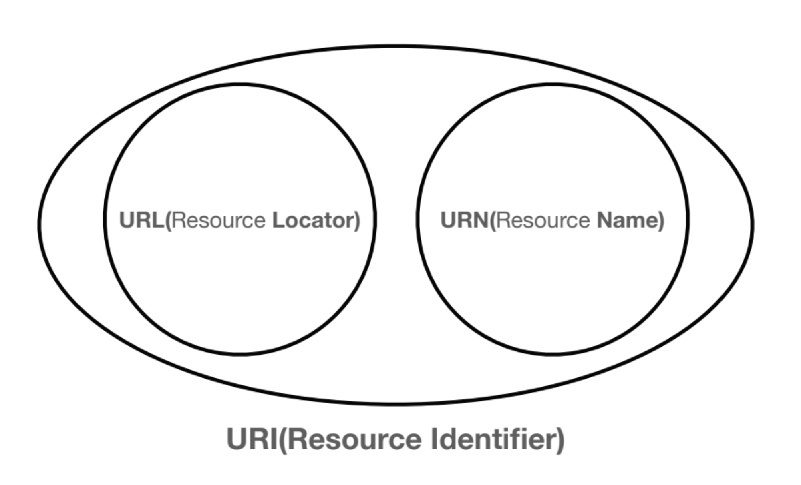
### **URI (Uniform Resource Identifier)**

- **Uniform** : 리소스 식별하는 통일된 방식이다.
- **Resource** : URI로 식별할 수 있는 모든 걸 자원이라고 한다. 웹 브라우저에 있는 HTML의 파일 것만 자원을 뜻하는 게 아니라 실시간 교통 정보 등등 이런것도 자원이라고 한다.
- I**denrifier** : 다른 항목과 구분하는 데 필요한 정보이다. 사람을 식별할 때 주민등록번호를 식별 하는 것처럼 말한다.
--------
### **URL (Uniform Resource Locator)**

- **Locator** : 리소스가 있는 위치를 지정한다.
--------
### **URN (Uniform Resource Name)**

- **Name** : 리소스에 이름을 부여한다.
위치는 변할 수 있지만 이름은 변하지 않는다. URN이 이름으로 실제 리소스가 결과 나오는게 매핑 되어야 하는데 찾기가 어렵다.

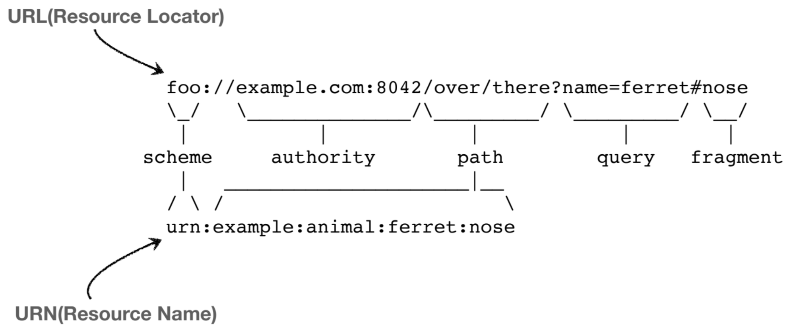

--------

- **Path - 경로**

> /home/file1.jpg   ➡️   home 이라는 경로에 file1.jpg가 있다.
>
>
> /home/file1.jpg   ➡️   home 이라는 경로에 file1.jpg가 있다.
>
> /members   ➡️   회원들에 대한 정보를 보여주는 경로이다.
>
>/members/100, /items/iphone12   ➡️  100번의 회원의 정보, 아이템 중에 아이폰12 정보 경로이다.

리소스가 있는 경로이자 계층적 구조로 되어 있다.

- **Query**

key와 value 형태로 데이터가 들어가 있다.

> **?keyA=valueA&keyB=valueB**

query는 ?로 시작하고 &로 추가적으로 query string를 입력한다.  숫자를 적어도 다 문자 형태로 넘긴다 해서 query string이라고 부른다.

- **fragment**

> https://docs.spring.io/spring-boot/docs/current/reference/html/getting-
>
>
> **#getting-started-introducing-spring-boot**
>

HTML 내부에서 중간에 이동하고 싶을 때 북마크 등에 사용한다. 잘 사용하지 않고 서버에 전송하는 정보가 아니다.

------
> **HTTP**
### HTTP 정의
HTTP(HyperText Transfer Protocol)는 월드 와이드 웹에서 정보를 교환하고 웹 서버와 클라이언트 사이의 통신을 가능하게 하는 프로토콜이다. 1990년대 초반, 웹의 창시자인 팀 버너스-리에 의해 처음 설계되었으며, 웹상의 문서를 주고받기 위한 표준 방식으로 발전했다.

## 웹 브라우저 요청 흐름

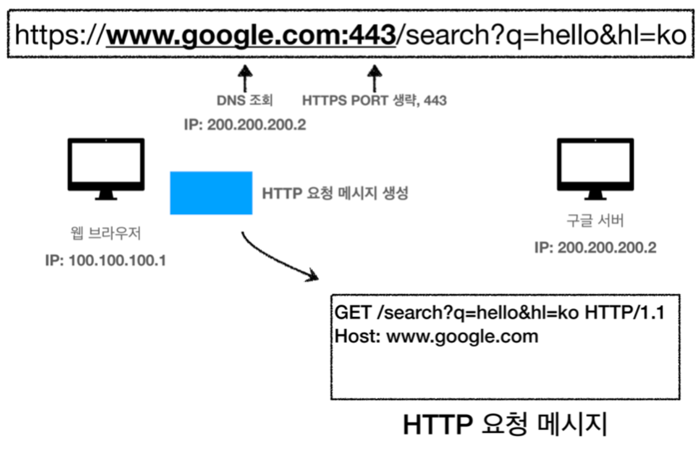
1. URL을 입력한다.
2. DNS(도메인) 서버로 IP를 찾아내고 생략된 PORT는 scheme로 찾아낸다.
3. 웹 브라우저가 HTTP요청 메시지가 생성된다.

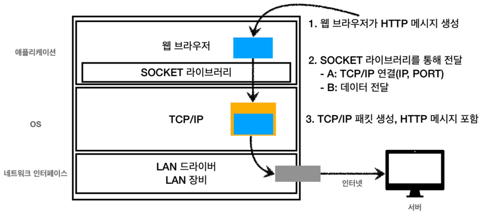
4. SOCKET 라이브러리를 통해서 TCP/IP로 찾은 IP와 PORT 정보를 **`3-WayHandshake`**방식으로 서버랑 연결을 한다.
5. HTTP 요청 메시지는 OS에 있는 TCP/IP 계층으로 전달한다.
6. TCP/IP 계층에서 HTTP요청 메시지에 패킷으로 감싼다.

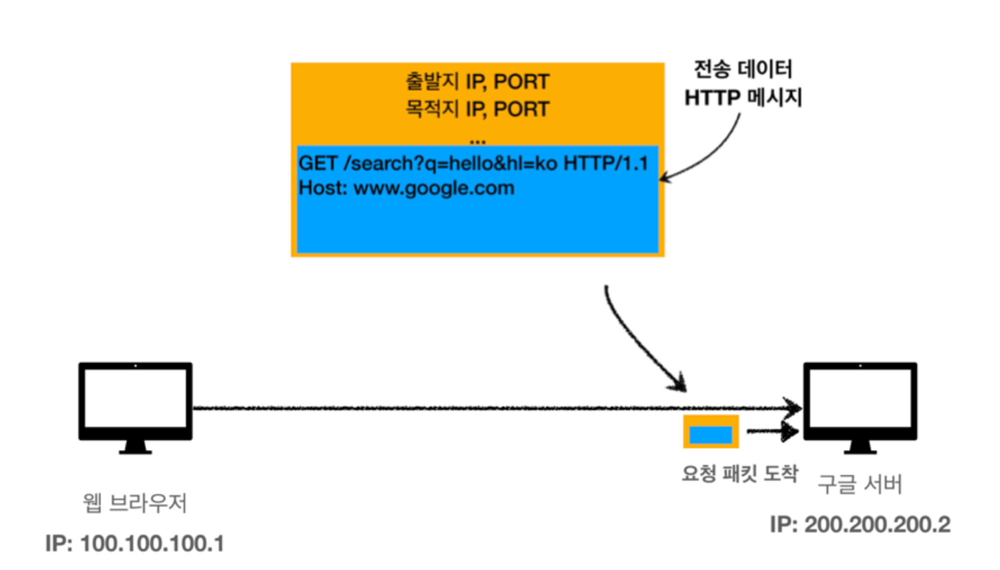
7. 웹 브라우저가 만든 요청 패킷을 서버에 도착하면 패킷을 열어서 HTTP 요청 메시지를 확인해서 서버가 해석한다.

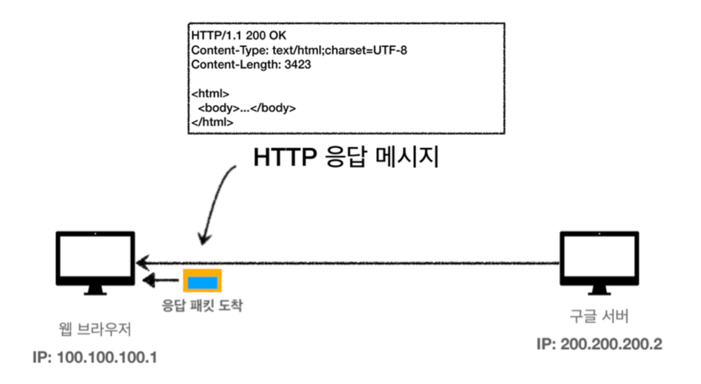
8. 서버가 HTTP 응답 메시지를 만들어서 TCP/IP 패킷을 감싸서 클라이언트에게 도착하면 패킷을 클라이언트가 해석한다.
9. 웹브라우저가 HTML 렌더링을 해서 클라이언트가 HTML결과를 볼 수 있게 된다.
-------
> HTTP 특징 정리
### 비연결성(Non-connection-oriented)
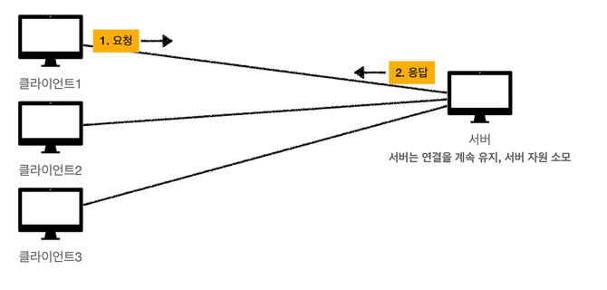 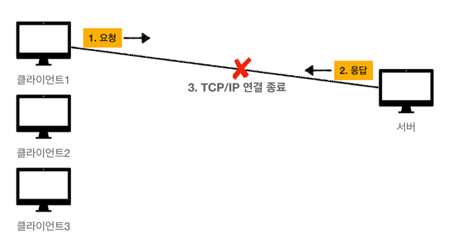
 - HTTP는 기본적으로 비연결성 프로토콜이다. 이는 클라이언트와 서버가 데이터를 교환한 후 즉시 연결을 끊는다는 것을 의미한다. 이로 인해 서버는 동시에 많은 클라이언트의 요청을 처리할 수 있지만, 각 요청 사이에 지속적인 상태 정보를 유지하지 않는다.
-------
### 무상태(Stateless)
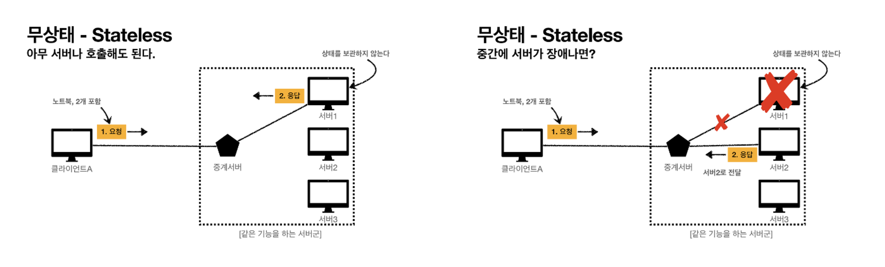
 - HTTP는 무상태 프로토콜이어서 서버가 클라이언트의 이전 요청에 대한 정보를 기억하지 않는다. 상태 정보가 필요한 경우, 쿠키와 같은 기술을 사용하여 상태를 유지할 수 있다.
-------
### 확장 가능성(Extensible)
 -  HTTP는 간단한 텍스트 기반의 프로토콜로, 새로운 메소드와 헤더를 쉽게 추가하여 기능을 확장할 수 있다.
-------
### 상태유지(Stateful)
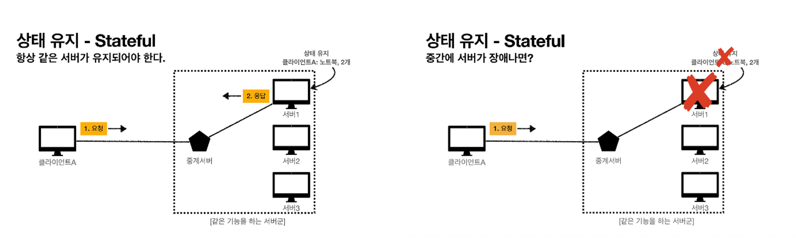
- Stateful이란 서버가 클라이언트의 상태를 보존해야하는 것이다. 클라이언트가 사용중인 서버가 만약 장애가 발생할 경우 클라이언트는 다른 서버에게 다시 한번 정보를 요청해야 한다.
-------

> 📚 Reference
> 
> REF1: https://www.inflearn.com/course/http-%EC%9B%B9-%EB%84%A4%ED%8A%B8%EC%9B%8C%ED%81%AC#
>
> REF2: https://hanjongmin.notion.site/Basic-WEB-8a0d65d5a15a4849b049f92f2ca72667
> 
> REF3: https://jaejade.tistory.com/52
>
> REF4: https://velog.io/@conatuseus/2019-09-10-2009-작성됨-xsk0ds2eqf
 