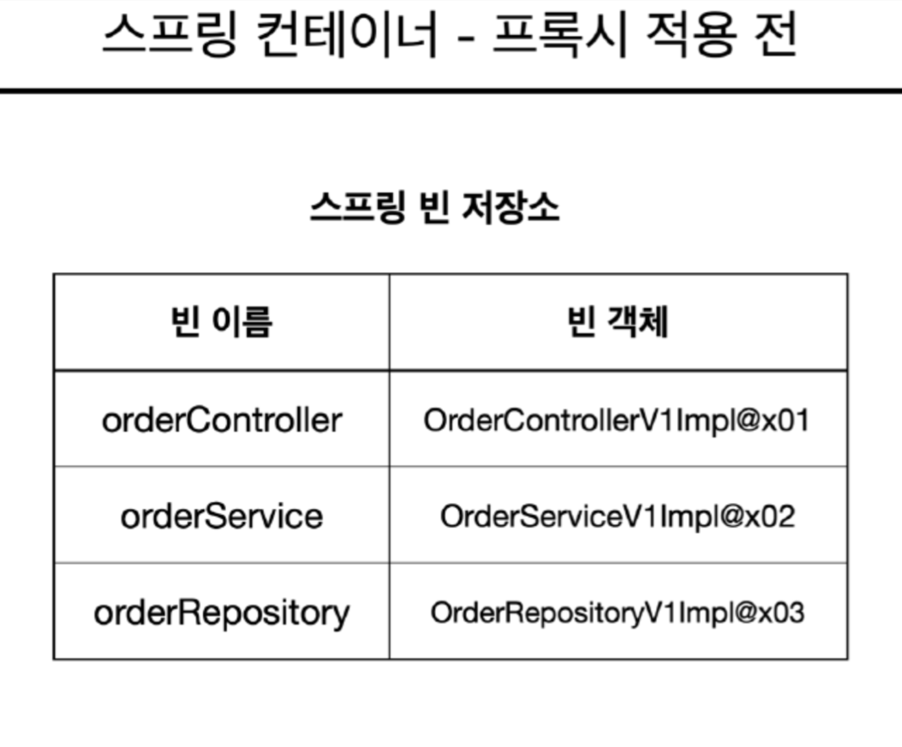

# 라이브러리와 프레임워크 비교해보기

- 라이브러리(Library)
    - **개발자들이 자주 사용하는, 재사용 할 수 있는 코드 집합**입니다.
    - 즉, 개발자가 사용할 수 있는 함수나 객체의 모음이며, 특정 작업을 수행하기 위해 필요한 도구들을 제공합니다.
    - 이를 사용하여 개발자들은 복잡한 기능을 더 쉽게 구현할 수 있습니다.
- 프레임워크(Framework)
    - **개발자들이 애플리케이션을 개발하는 데 사용되는 구조를 제공**합니다.
    - 프레임워크는 일련의 규칙과 구조를 정의하고, 개발자가 애플리케이션을 작성할 때 이러한 규칙과 구조를 따르도록 합니다.

> **비유로 이해해보기**

라이브러리는 요리를 할 때 사용하는 주방 도구나 재료들과 같습니다. 예를 들어, 빵을 굽기 위해 오븐을 사용하고, 면을 삶기 위해 냄비를 사용하는 것과 유사합니다.

프레임워크는 요리를 할 때 보는 레시피와 같습니다. 주어진 재료와 레시피대로 요리를 해야하며, 이것을 벗어나면 안되고 이를 따르면 더 좋은 요리를 만들 수 있습니다.


# 스프링 프레임워크 간단히 알아보기

- 스프링 프레임워크란?
    - **자바(Java) 플랫폼을 위한 오픈 소스 애플리케이션 프레임워크**입니다.
    - 쉽게 말해, 자바 개발을 편리하게 해주는 프레임워크 입니다.
- 핵심 기능
    - **의존성 주입 (Dependency Injection ; DI)**
        - 객체 간의 의존성을 외부에서 주입해 결합도를 줄이고, 유연하고 확장 가능한 코드를 작성할 수 있게 해줍니다.
        - 객체들간의 의존관계에 대한 부담을 덜어주기 때문에 개발자가 핵심 로직에 집중할 수 있습니다.
    - **관점 지향 프로그래밍 (Aspect Oriented Programming ; AOP)**
        - 로깅이나 인증, 보안과 같이 여러 모듈들의 공통 관심사항을 따로 분리하여 관리할 수 있습니다.
        - 중복 코드를 제거할 수 있으며, 재활용성을 극대화 할 수 있습니다.

# Java 객체 생성 알아보기

### 객체, 인스턴스 비교하기

- 객체
    - 객체는 클래스에 의해 정의된 구조를 실체화한 것으로, 속성(변수)과 메서드(함수, 행동) 을 가진 모든 것을 의미합니다.
- 인스턴스
    - 인스턴스는 특정 클래스로부터 생성된 객체를 의미합니다.
    - 즉, **클래스를 기반으로 메모리에 할당된 실체**를 말합니다.

> 클래스의 타입으로 **선언되었을 때 객체**라고 부르고, 그 객체가 **메모리에 할당되어 실제 사용될 때 인스턴스**라고 합니다.
>

```java
class Car {

	...
	
}

public class Main {
	public static void main(String[] args) {
		Car hyundai, kia; // 객체
		
		//인스턴스화
		//객체를 메모리에 할당
		hyundai = new Car(); //hyundai 는 Car 클래스의 인스턴스
		kia = new Car(); //kia 는 Car 클래스의 인스턴스
	}
}
```

### 객체가 무한히 생성됐을 때의 문제점 알아보기

- 객체가 메모리 상에 생성될 때 마다, 해당 객체의 데이터를 저장하기 위해 **메모리 공간이 소비**됩니다.
- 객체가 무한히 많이 생성되면, 사용 가능한 **메모리 공간이 점점 줄어들게 되어 최종적으로 메모리 부족 상황을 초래**할 수 있으며, 이로 인해 **프로그램이 비정상적으로 종료**될 수 있습니다.
- 자바의 경우 가비지 커렉션(GC)기능을 사용하여 더이상 사용하지 않는 객체들을 메모리에서 자동적으로 제거하게 됩니다.
- 객체가 무한히 많이 생성되면, **가비지 컬렉터가** 이들을 처리하기 위해 더 **많은 시간을 소비**하게 되고 최종적으로 **프로그램의 성능 저하**가 발생할 수 있습니다. (가비지 컬렉터가 실행되는 경우, 모든 프로그램이 일시적으로 중단됩니다.)
- **웹 서버의 경우**, 사용자의 요청이 들어올 때 마다 객체가 무한히 생성되게 된다면, 위와 같은 사유들로 인해 **서버의 성능 저하가 발생하거나 DoS 공격에 취약하여 정상적인 운영이 불가능해질 수 있습니다.**

### 싱글톤 패턴 알아보기

- **위와 같은 문제점들을 웹 서버상에서 해결하기 위해 싱글톤 패턴을 사용**합니다.
- 소프트웨어 디자인 패턴 중 생성 패턴중 하나로, **특정 클래스의 인스턴스가 단 하나만 생성되도록 보장하는 대신 어디서든 그 인스턴스에 접근할 수 있도록 하는 패턴**입니다.

```java
public class Singleton {
    // Private static 인스턴스 변수
    private static Singleton instance;

    // Private 생성자
    private Singleton() {}

    // public static 메소드
    public static Singleton getInstance() {
        if (instance == null) {
            // 인스턴스가 없으면 생성
            instance = new Singleton();
        }
        return instance;
    }
}
```

> static 키워드를 사용하게 된다면 static 영역에 할당되게 됩니다.
객체 생성 없이 사용할수 있으며, 프로그램 시작시 할당 되어 프로그램이 종료될 때 해제됩니다.
>

# [심화]왜 스프링을 써야하는지 고민해보기

# 스프링 빈과 스프링 컨테이너

### 스프링 컨테이너가 무엇인지 알아보기

- **스프링에서 자바 객체들을 관리하는 공간**을 말합니다.
- 쉽게 말해, **자바 객체들의 생성부터 소멸까지를 개발자 대신 관리해주는 곳**이라고 할 수 있습니다.
- 자바 객체들의 생성 뿐만 아니라 서로 잘 연결될 수 있도록 관리하고 제어하는 역할도 수행합니다.

### 스프링 빈이 무엇인지 알아보기

- 위에서 언급한 **스프링 컨테이너가 관리하는 자바 객체를 빈(Bean)** 이라고 합니다.

<aside>
💡 **개발자는 애플리케이션에서 필요로 하는 객체를 스프링 컨테이너에 등록하고, 스프링 컨테이너는 이 객체들을 관리합니다.**

</aside>

### `@Bean`, `@Configuration` 애노테이션 알아보기

두 어노테이션 모두 스프링 프레임워크에서 객체 생성 및 의존성 주입 설정을 위해 사용됩니다.

- **`@Configuration`**
    - `@Configuration` 어노테이션의 경우, **클래스에 붙여** 해당 클래스가 **스프링의 설정 정보를 담고 있는 클래스 임을 나타냅니다.**
    - 자바 객체의 **프록시**를 생성해주는 CGLIB (코드 생성 라이브러리) 을 사용하여 **스프링 빈이 싱글톤으로 생성됨을 보장**해 준다는 특징이 있습니다.




- **`@Bean`**
    - `@Bean` 어노테이션의 경우, **메소드에 붙여** 해당 메서드가 반환하는 객체를 스프링 컨테이너에 등록할 빈으로 선언합니다.
    - 즉, **메소드의 반환 값을 스프링 컨테이너가 관리하는 빈으로 등록**합니다.
    - 이 때  **메소드 이름으로 빈 이름이 결정**되므로, 중복된 빈 이름이 존재하지 않도록 주의해야 합니다.

```java
@Configuration
public class BasicConfig {

		@Bean
		public Car car() {
				return new Car();
		}
}
```

<aside>
💡 위와 같은 식으로 코드를 작성하여, **수동으로 스프링 컨테이너에 빈을 등록**할 수 있습니다.

</aside>

# 의존성 주입(Dependency Injection ; DI)

### 의존성 주입이 무엇인지 알아보기

- 의존성이란?
    - 객체지향 프로그래밍으로 개발을 진행하면 어떤 클래스는 다른 클래스의 참조가 필요한 경우가 존재합니다. 이런 경우를 의존한다라고 표현합니다.
    - 즉, “**A 가 B 에 의존한다”**  라는 표현은 의존대상 B가 변하면 그것이 A에 영향을 미친다고 이해할 수 있습니다.
    - 예를 들어, 요리사가 레시피를 보고 요리를 할 때, 레시피가 변화하게 된다면 변화된 레시피에 따라 요리사는 방법을 수정해야 합니다. 이렇듯 **레시피의 변화가 요리사의 행위에 영향을 미쳤기 때문에, “요리사는 레시피에 의존한다”** 라고 말할 수 있습니다.

```java
class Chef {
	private Recipe recipe;
	
	public Chef() {
		recipe = new BergerRecipe();
	}
}
```

- 그렇다면 의존성 주입(Dependency Injection ; DI)란?
    - 위에서 설명한 **객체 간의 의존 관계를 외부에서 주입해주는 방식**을 말합니다.
    - 의존성 주입을 통해 객체는 자신이 필요로 하는 **객체를 직접 생성하지 않더라도 외부로부터 받아올 수 있습니다.**
    - 의존성 주입의 목적은 객체간의 결합도를 낮추고 유연성 및 재사용성을 높이는데 있습니다.

### 스프링에서 어떻게 의존성 주입이 일어나는지 알아보기

- 스프링에서는 **스프링 컨테이너에 객체(Bean)을 먼저 생성해두고 생성한 객체를 지정한 객체에 주입하는 방식**을 의존성 주입이라고 합니다.
- 총 3가지 방식으로 의존성 주입을 사용할 수 있습니다.
    - 필드 주입(Field Injection), 세터 주입(Setter Based Injection), **생성자 주입(Constructor Based Injection)**

```java
//의존성 주입 x
@Controller
public class MainController {
	//객체를 직접 new로 생성
	HomeService homeService = new HomeService();
}

//필드 주입
@Controller
public class MainController {
	@Autowired
	private HomeService homeService;
}

//세터 주입
@Controller
public class MainController {
	private HomeService homeService;
	
	@Autowired
	public void setHomeService(HomeService homeService) {
		this.homeService = homeService;
	}
}

//생성자 주입
@Controller
public class MainController {
	private HomeService homeService;
	
	@Autowired
	public MainController(HomeService homeService) {
		this.homeService = homeService;
	}
}
```

- 스프링에서는 **생성자 주입 방식을 권장**하고 있습니다.
    - 생성자 주입 방식을 사용하게 되면, **객체가 생성되는 시점에** 생성자를 호출하여 **최초 1회만 주입**을 하기 때문에, **불변 객체를 보장**하고, 객체를 포함한 클래스가 생성되는 시점에 포함된 객체들도 반드시 생성되기 때문에 객체가 비어있을 가능성도 배제합니다.
    - **필드 주입과 세터 주입은** 실제 메서드가 호출되었을 때, **런타임 에러**가 발생하게 되어 **미리 예측이 힘들지만**, **생성자 주입**의 경우 스프링 어플리케이션이 구동되는 순간에 에러가 발생 즉, **컴파일 타임에 에러**가 발생하게 됩니다. 컴파일 에러는 **개발자가 쉽게 추적이 가능**하기 때문에 서비스를 운영하기 전에 미리 예방할 수 있습니다. (순환 참조 에러)

### **[심화]**  객체지향 설계 원칙 : SOLID 알아보기

**SOLID** 원칙이란 객체지향 설계에서 지켜줘야 할 5개의 소프트웨어 개발 원칙 (**S**RP, **O**CP, **L**SP, **I**SP, **D**IP) 의 줄임말입니다.

- **S**RP ; Single Responsibility Principle ; 단일 책임 원칙
    - **클래스는 단 하나의 책임만 가져야 한다**는 원칙입니다.
    - 즉, 하나의 클래스는 하나의 기능을 담당하여 하나의 책임을 수행하게 설계하라는 말입니다.
    - 예를 들어, A 라는 클래스를 고쳤더니, B를 수정하고, B를 고쳤더니 C를 고치고 이런 형태를 띄면 안된다는 것입니다.
    - 결과적으로, **프로그램의 유지보수성을 높이기 위한** 설계 원칙입니다.
- **O**CP ; Open Closed Principle ; 개방 폐쇄 원칙
    - **확장에는 열려있어야 하지만, 변경에는 닫혀 있어야 한다**는 원칙입니다.
        - 새로운 변경 사항이 발생했을 경우 큰 힘을 들이지 않고 기능을 확장할 수 있어야 함. (객체를 직접적으로 수정하지 않고)
    - 쉽게말해 추상화를 사용한 관계 구축을 권장한다는 의미입니다.
        - [https://inpa.tistory.com/entry/OOP-💠-아주-쉽게-이해하는-OCP-개방-폐쇄-원칙](https://inpa.tistory.com/entry/OOP-%F0%9F%92%A0-%EC%95%84%EC%A3%BC-%EC%89%BD%EA%B2%8C-%EC%9D%B4%ED%95%B4%ED%95%98%EB%8A%94-OCP-%EA%B0%9C%EB%B0%A9-%ED%8F%90%EC%87%84-%EC%9B%90%EC%B9%99)
- **L**SP ; Lisotv Subsitution Principle ; 리스코브 치환 원칙
    - **서브 타입은 언제나 부모 타입으로 교체**할 수 있어야 한다는 원칙입니다.
    - 쉽게 말해, **다형성을 이용하기 위한 원칙**입니다.
- **I**SP ; Interface Segregation Principle ; 인터페이스 분리 원칙
    - **인터페이스를 각각 사용에 맞게 끔 작게 분리**해야 한다는 원칙입니다.
    - 클래스의 단일 책임과 유사하게 **인터페이스의 단일 책임을 강조**하는 것으로 생각하면 됩니다.
- **D**IP ; Dependency Inversion Principle ; 의존 역전 원칙
    - 어떤 클래스를 참조해야 하는 상황이 발생하면, 해당 클래스의 **상위 요소로 참조하라는 원칙**입니다.
    - 쉽게 말해, **구현 클래스에 의존하지 말고, 인터페이스에 의존**하라는 뜻입니다.

**SOLID 객체 지향 원칙을 적용**하면 **코드를 확장**하고 **유지 보수 관리**하기가 더 쉬워지며, 불필요한 **복잡성을 제거**해 리팩토링에 소요되는 시간을 줄임으로써 프로젝트 **개발의 생산성**을 높일 수 있습니다.

# 제어의 역전(Inversion of Control ; IoC)

### 제어의 역전이 무엇인지 알아보기

- **객체의 생성 및 관리 책임**을 개발자에서 **전체 애플리케이션 또는 프레임워크에 위임**하는 것을 말합니다.
- 프레임워크를 사용하지 않고 개발을 진행한다면, 객체의 생성, 설정, 초기화, 메소드 호출, 소멸까지 객체의 모든 라이프사이클을 개발자가 직접 관리하게 됩니다.
- 하지만 프레임워크를 사용하게 된면, 프레임워크의 틀 안에서 개발자가 짜둔 코드를 호출하게 되어 **흐름에 대한 제어권을 프레임워크**가 가지게 되고, **객체의 모든 라이프 사이클 또한 프레임워크가 관리**하게 됩니다.

### [심화]제어의 역전과 의존 주입의 연관 관계 생각해보기

- **제어의 역전은** 프로그램의 제어 흐름 구조를 바꾸는 **원칙**이고, **의존성 주입은** 이러한 **원칙을 구현하는 방법** 중 하나 입니다.
- 프로그램의 흐름을 개발자가 아닌 외부 프레임워크가 결정하게 하는 것을 제어의 역전이라고 하고, 외부 프레임워크가 객체간의 의존성을 관리하고 주입하는 방식을 통해 제어의 역전을 달성할 수 있는데, 외부에서 객체간의 의존성을 관리하고 주입하는 방식이 바로 의존성 주입입니다.
- 스프링의 경우, 스프링 컨테이너가 객체들을 생성하고 객체간의 의존 관계를 주입함으로써 즉, 의존성 주입을 통해 제어의 역전을 실현하고 있습니다.