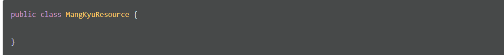
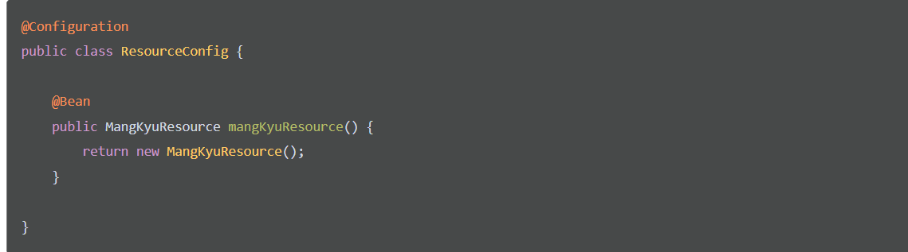
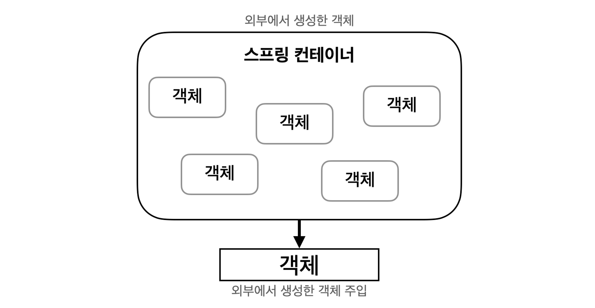
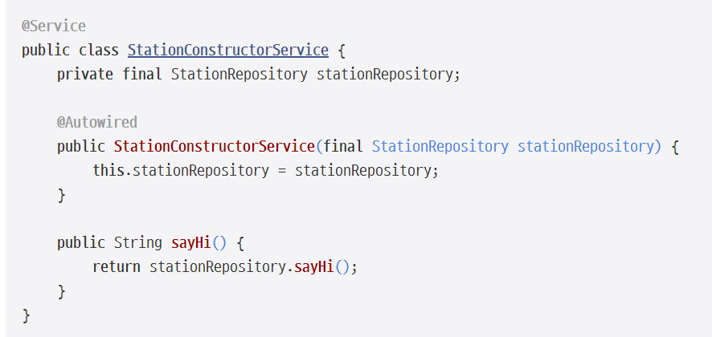
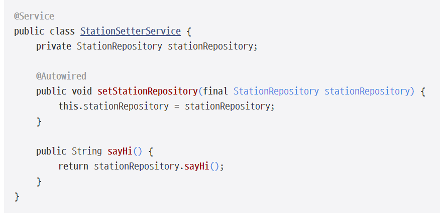
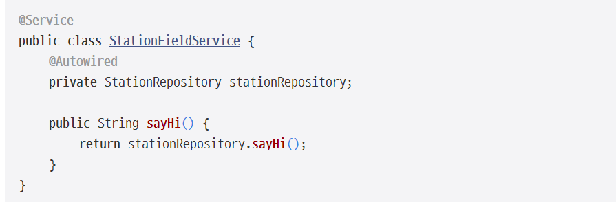

# 1. 프레임워크, 라이브러리
## 1-1. 프레임워크, 라이브러리란?
### \#프레임워크 
    -뼈대나 기반구조를 뜻하고, 제어의 역전 개념이 적용된 대표적인 기술

- 소프트웨어에서의 프레임워크 
  - '소프트웨어의 특정 문제를 해결하기 위해서 상호 협력하는 클래스와 인터페이스의 집합'  
  - 완성된 어플리케이션이 아닌 프로그래머가 완성시키는 작업이 필요

- 객체 지향 개발  
--> 통합성, 일관성의 부족이 발생되는 문제를 해결할 방법 중 하나

- 특징  
    - 특정 개념들의 추상화를 제공하는 여러 클래스나 컴포넌트로 구성  
    - 추상적인 개념들이 문제를 해결하기 위해 같이 작업하는 방법  
    - 컴포넌트들의 재사용  
    - 높은 수준에서 패턴들 조작화

### \#라이브러리 
    -단순 활용가능한 도구들의 집합  
    -개발자가 만든 클래스에서 호출하여 사용  
    -클래스들의 나열로 필요한 클래스를 불러서 사용하는 방식

## 1-2. 프레임워크, 라이브러리 차이점
### \#라이브러리와 프레임워크의 차이  
    -제어 흐름에 대한 주도성이 누구에게/어디에 있는가  
    -애플리케이션의 흐름을 누가 쥐고 있느냐

- 프레임워크  
  - 전체적인 흐름을 스스로가 쥐고 있어 사용자는 그 안에서 필요한 코드를 짜 넣음
- 라이브러리  
  - 사용자가 전체적인 흐름을 만들며 라이브러리를 가져다 씀.

>**==> 라이브러리는 라이브러리를 가져다가 사용하고 호출하는 측에 전적으로 주도성이 있음**  
>>**==> 프레임워크는 그 자체로 이미 제어 흐름에 대한 주도성을 가지고 있음**

### ex) 애플리케이션 코드의 경우  
- 라이브러리  
  - 애플리케이션 흐름을 직접 제어  
  - 동작하는 중에 필요한 기능이 있을 때 능동적으로 라이브러리를 사용

- 프레임워크  
    - 애플리케이션 코드가 프레임워크에 의해 사용  
    - 프레임워크 위에 개발한 클래스를 등록  
    - 프레임워크가 흐름을 주도하는 중에 개발자가 만든 애플리케이션 코드를 사용하도록 만드는 방식  
    - 제어의 역전 개념이 적용  
    - 애플리케이션 코드는 프레임워크가 짜놓은 틀에서 수동적으로 동작해야 함

#### `라이브러리` 
>- 개발자가 모든 개발의 흐름을 제어  
>- 개발자가 주가 되어 필요한 기능을 호출하고 능동적으로 사용  
#### `프레임워크`
>- 개발자가 아닌 프로그램이 흐름을 제어

_**즉,프로그램의 주도성이 누구에게 있는가**_

## 1-3. Spring Framework  
    - 자바 플랫폼을 위한 오픈소스 어플리케이션 프레임워크 
    - 엔터프라이즈급 어플리케이션을 개발하기 위한 모든 기능을 종합적으로 제공하는 경량화된 솔루션

**엔터프라이즈급 개발**
- 대규모 데이터 처리와 트랜잭션이 동시에 여러 사용자로 부터 행해지는 매우 큰 규모의 환경에서의 개발

### Spring framework 특징
>#### IoC ( Inversion of Control ) : 제어의 역전
>>- 제어의 주체가 개발자가 아닌 프레임워크라는 뜻
>>- 때에 따라 프레임워크가 작성된 코드를 호출하는 기술
>>- 객체의 생명주기의 관리까지 모든 객체에 대한 제어권을 프레임워크가 가짐
 

>#### DI ( Dependency Injection ) : 의존 주입
>>- 의존성 객체를 개발자가 생성하지 않고 클래스를 Bean으로 등록해놓으면 Bean으로 등록된 객체를 프레임워크가 찾아서 알아서 주입해주는 기술
>>- 모듈 간의 결합도를 낮출 수 있다.

**Bean?**  
-스프링은 스프링컨테이너를 통해 객체를 관리하는데, 스프링 컨테이너에 관리되는 객체

>#### AOP ( Aspect Oriented Programming ) : 관점 지향 프로그래밍
 >>- 각 코드마다 공통된 관심사를 분리하여 모듈화하는 프로그래밍 기법
 >>- 객체지향적으로 프로그래밍을 했음에도 로그, 트랜잭션, 성능확인 등 공통적인 관심사가 중복되는 문제점을 해결하기 위해 프록시 패턴을 사용하여 코드를 분리하여 관리하는 기술

**Proxy?**
  - 다른 무언가와 이어지는 인터페이스의 역할을 하는 클래스
  - 네트워크 연결, 메모리 안의 커다란 객체, 파일, 또 복제할 수 없거나 수요가 많은 리소스와도 인터페이스의 역할을 수행

 

>#### POJO : Plane Old Java Object (순수 자바 객체) 
>>-EJB 등에서 사용되는 Java Bean이 아닌 멤버 변수와 Getter와 Setter로 구성된 가장 순수한 형태의 기본 클래스

**EJB?**  
- 기업들에게, 새로운 프로그램 컴포넌트가 추가되거나 또는 변경될 때마다 각 개별 컴퓨터를 갱신하지 않고서도 서버에서 변화를 통제할 수 있도록 하는 이점을 제공  

**Getter?**    
- 반환할 값을 의미하며 반환할 값을 얻어야 하기 때문에 return이 get을 사용할 코드 안에서 꼭 필요  

**Setter?**  
- 데이터를 set할 때 즉 데이터를 수정할 때 사용되며 set은 데이터를 수정하거나 셋할때 사용  

 

>#### PSA ( Portable Service Abstraction ) : 추상화를 통한 간결한 코드
>>- POJO 프로그래밍을 지원하기 위해 다양하게 구현되어있는 인터페이스를 같은 방식으로 사용하도록 중간에 인터페이스 어댑터 역할을 해주는 레이어를 추가
>>- 실제로 일일이 구현을 해줘야 되는 것들을 스프링이 다 구현해놓고 annotation으로 만들어 놓아 annotation 선언하면 내부적으로 다 동작이 되도록 추상화  
  
**Annotation?**  
  - 작성한 코드에 대해 추가적인 정보를 제공하면서 컴파일 타임 혹은 런타임 시점에서 해당 코드에 필요한 추가적인 처리를 해 주는 역할을 함
  - 일반적으로 주석을 통해 다른 사람이 이해할 수 있도록 부연 설명을 작성
    - 중복된 내용에 대해 일일이 주석을 달기는 번거로움
  - 공통적이면서 주요하게 알려야 되는 내용은 @와 함께 약속된 단어를 붙여 표시

# 2. 자바 객체, 인스턴스

    객체 지향 프로그램?

    -프로그램을 단순히 데이터와 처리 방법으로 나누는 것이 아니라, 프로그램을 수많은 '객체' 라는 기본 단위로 나누고 이 객체들의 상호작용으로 서술하는 방식

### Class   
- 개념
  -  객체를 정의하고 만들어 내기 위한 설계도 혹은 틀
  - 연관되어 있는 변수와 메서드의 집합
- 특징
  - 객체의 상태를 나타내는 필드와 객체의 행동을 나타내는 메소드로 구성
  - 필드 ==> 클래스에 포함된 변수(variable)를 의미
  - 메소드 ==> 어떠한 특정 작업을 수행하기 위한 명령문의 집합

### 객체  
- 개념
  - 소프트웨어 세계에 구현할 대상
  - 클래스에 선언된 모양 그대로 생성된 실체
- 특징
  - '클래스의 인스턴스'라고 부름

### 인스턴스  
- 개념
  - 설계도를 바탕으로 소프트웨어 세계에 구현된 구체적인 실체
  - 객체를 소프트웨어에 실체화 하면 그것을 '인스턴스'라고 부름
  - 실체화된 인스턴스는 메모리에 할당
- 특징
  - 인스턴스는 객체에 포함
  - oop의 관점에서 객체가 메모리에 할당되어 실제 사용될 때 '인스턴스'라고 부름
  - 추상적인 개념과 구체적인 객체 사이에 초점을 맞출 경우에 사용
  - 즉, 인스턴스라는 용어는 반드시 클래스와 객체 사이의 관계로 한정지어서 사용할 필요 X

# 3. 싱글톤 패턴
## 싱글톤 패턴
	- 특정 클래스의 인스턴스를 1개만 생성되는 것을 보장하는 디자인 패턴
	- 생성자를 통해서 여러 번 호출이 되더라도 인스턴스를 새로 생성하지 않고 최초 호출 시에 만들었던 인스턴스를 재활용하는 패턴이다.

### 3-1. 객체가 무한히 생성됐을 때의 문제점
- 메모리나 레지스터가 할당할 수 있는 공간은 한정적
  - Destructor가 호출되지 않는다면무한하게 많은 객체를 생성하였을 때는 더 이상 사용할 수 있는 공간이 없을 수 있음.
- 사용자가 1초에 10번 똑같은 요청을 보내면 요청을 처리하기 위한 똑같은 객체를 1초에 10번 생성하고 소멸되는 메모리 낭비 문제가 발생

==> **메모리 낭비를 방지**  
- 싱글톤 패턴을 사용하면 최초 한번 new로 객체를 생성하고 해당 객체를 이후에도 사용하도록 공유(static)

### 3-2. 싱글톤 패턴 문제점

#### 높은 의존성
    - 클래스의 객체를 미리 생성한 뒤에 필요한 경우 메서드를 이용  
    - 클래스 사이에 의존성이 높아짐
    ---> 싱글톤의 인스턴스가 변경 되면 해당 인스턴스를 참조하는 모든 클래스들을 수정해야 하는 문제가 발생

#### private 생성자에 의한 상속의 어려움
    - 기본 생성자를 private로 만듦
    - 상속을 통한 자식 클래스를 만들 수 없음
    ---> 자바의 객체지향 언어의 장점 중 하나인 다형성을 적용하지 못함

#### 테스트하기 어려움
    - 싱글톤 패턴의 인스턴스는 자원을 공유하고 있다는 특징이 있음
    --->독립적이어야 하는 단위 테스트를 하는데 문제
    
    독립적인 테스트가 진행이 되려면 전역에서 상태를 공유하고 있는 인스턴스의 상태를 매번 초기화해야 함
    --->초기화해주지 않으면 전역에서 상태를 공유 중이기 때문에 테스트가 정상적으로 수행되지 못할 가능성이 존재

# 4. Spring @Bean, @Configuration

## 4-1. 빈(Bean)
    - 스프링 컨테이너에 의해 관리되는 재사용 가능한 소프트웨어 컴포넌트
    - 스프링 컨테이너가 관리하는 자바 객체를 뜻하며, 하나 이상의 Bean을 관리
    - 인스턴스화된 객체를 의미하며, 스프링 컨테이너에 등록된 객체를 스프링
    - 쉽게 이해하자면 new 키워드 대신 사용

### 사용하는 이유?
- 스프링 간 객체가 의존관계를 관리하도록 함
- 객체가 의존관계를 등록할 때 스프링 컨테이너에서 해당하는 빈을 찾고, 그 빈과 의존성을 많듦

### @Configuration
- 설정파일을 만들기 위한 애노테이션 or Bean을 등록하기 위한 annotaiton
- Bean 등록시 싱글톤이 되게 보장 + 스프링 컨테이너에서 Bean 관리 가능

## 4-2. Bean 등록법  

>### xml에 직접 등록
 >> - '@Bean' 태그를 사용

**Xml?**  
- Extensible Markup Language(XML), 공유 가능한 방식으로 데이터를 정의하고 저장
- XML은 웹 사이트, 데이터베이스 및 타사 애플리케이션과 같은 컴퓨터 시스템 간의 정보 교환을 지원
- 사전 정의된 규칙을 사용하면 수신자가 이러한 규칙을 사용하여 데이터를 효율적으로 정확하게 읽을 수 있음
==> 모든 네트워크에서 데이터를 XML 파일로 손쉽게 전송할 수 있음
  
  
>### @Bean, @Configuration annotation 사용
>>다음과 같은 클래스가 있고, 이를 스프링 컨테이너에 등록하고자 한다면

>>Bean으로 등록하기 위해 명시적으로 설정 클래스에서 @Bean annotation을 사용해 수동으로 스프링 컨테이너에 빈을 등록하는 방법이 있음.  
>
>>클래스는 다음과 같이 @Configuration annotation을 클래스에 붙여주면 됨
>>- @Bean을 사용해 수동으로 빈을 등록해줄 때에는 메소드 이름으로 빈 이름이 결정됨
>>  - 중복된 빈 이름이 존재하지 않도록 주의

>
>>1. 스프링 컨테이너는 @Configuration이 붙어있는 클래스를 자동으로 빈으로 등록  
>>2. 해당 클래스를 파싱해서 @Bean이 있는 메소드를 찾아서 빈을 생성  

**어떤 임의의 클래스를 만들어서 @Bean 어노테이션을 붙인다고 되는 것은 아님.**
- @Bean을 사용하는 클래스에는 반드시 @Configuration 어노테이션을 활용하여 해당 클래스에서 Bean을 등록하고자 함을 명시해주어야 함  

>_**@Configuration 안에서 @Bean을 사용해야 싱글톤을 보장받을 수 있으므로 @Bean 어노테이션은 반드시 @Configuration과 함께 사용해주어야 함**_ 
>>- 이러한 @Bean 어노테이션의 경우는 수동으로 빈을 직접 등록해줘야만 하는 상황이며 주로 다음과 같을 때 사용
>>  1. 개발자가 직접 제어가 불가능한 라이브러리를 활용할 때
>>  2. 애플리케이션 전범위적으로 사용되는 클래스를 등록할 때
>>  3. 다형성을 활용하여 여러 구현체를 등록해주어야 할 때

출처: https://mangkyu.tistory.com/75 [MangKyu's Diary:티스토리]

# 5. Spring container
## 5-1. Spring container
    - 스프링 프레임워크의 핵심 컴포넌트
    - 자바 객체의 생명 주기를 관리하며, 생성된 자바 객체들에게 추가적인 기능을 제공
    - 스프링에서 자바 객체 == 빈(Bean)

**==>  스프링 컨테이너는 내부에 존재하는 빈의 생명주기를 관리(빈의 생성, 관리, 제거 등)하며, 생성된 빈에게 추가적인 기능을 제공**  

스프링 컨테이너는 XML, annotation 기반의 자바 설정 클래스로 만들 수 있음

## 5-2. 구현
### - Beanfactory, ApplicationContext -

#### Beanfactory
    - 빈의 생성과 관계설정 같은 제어를 담당하는 IoC 오브젝트
    - 스프링 컨테이너의 최상위 인터페이스
    - Bean을 등록, 생성, 조회 등의 빈을 관리하는 역할
    - getBean() 메서드를 통해 빈을 인스턴스화
    - @Bean annotation이 붙은 메서드의 이름을 스프링 빈의 이름으로 사용하여 등록

#### ApplicationContext
    - Beanfactory를  확장한 것
    -  IoC 방식을 따라 만들어진 일종의 빈 팩토리
    - 주로 사용됨
    - BeanFactory의 기능을 상속받아 제공
- Bean을 관리하고 검색하는 기능을 BeanFactory가 제공하고, 그 외의 부가 기능을 제공  
  - 부가기능  
    - MessageSource : 메시지 다국화를 위한 인터페이스
    - EnvironmentCapable : 개발, 운영, 환경변수 등으로 나누어 처리하고, 애플리케이션 구동 시 필요한 정보들을 관리하기 위한 인터페이스
    - ApplicationEventPublisher : 이벤트 관련 기능을 제공하는 인터페이스
    - ResourceLoader : 파일, 클래스 패스, 외부 등 리소스를 편리하게 조회
    
_**--> 둘 다 동일한 개념이라 생각하면 됨**_
## 5-3. 스프링 컨테이너의 기능
  

>**1) 빈(Bean)의 인스턴스화, 구성, 전체 생명 주기 및 제거**
>>- 컨테이너는 개발자가 정의한 빈을 객체로 만들어 관리하고 개발자가 필요로 할 때 제공  
>
>**2) 스프링 컨테이너를 통해 원하는 만큼 많은 객체 생성 가능**  
>
>**3) 의존성 주입(DI)을 통해 애플리케이션의 컴포넌트를 관리**
>
>**4) 서로 다른 Bean을 연결하여 Application Bean을 연결하는 역할**
>>- 개발자는 모듈 간에 의존 및 결합으로 인해 발생하는 문제로부터 자유로움
>>- 메서드가 언제 어디서 호출되어야 하는지, 메서드를 호출하기 위해 필요한 매개 변수를 준비해서 전달 X

## 5-4. 프링 컨테이너를 사용하는 이유

객체를 생성하기 위해서는 new 생성자를 사용
- 애플리케이션에서는 수많은 객체가 존재하고 서로를 참조  
    =>  객체 간의 참조가 많으면 많을수록 의존성이 높아짐  
    ==>  낮은 결합도와 높은 캡슐화를 지향하는 객체지향 프로그래밍의 핵심과는 거리가 멂  
    ===> 스프링 컨테이너 사용
  

- 기존의 방식으로는 새로운 기능이 생기게 되면 변경 사항들을 수작업으로 수정  
  => 프로젝트가 커질수록 의존도는 증가  
  ==> 코드의 변경도 많아짐  
  ==> 스프링 컨테이너 사용(구현 클래스에 있는 의존성 제거, 인터페이스에만 의존하도록 설계)  

# 6. 의존성 주입(DI)

### 애플리케이션에는 여러 개의 객체가 서로 협력하며 동작함
- 객체 간의 의존성(파라미터나 리턴값 또는 지역변수 등으로 다른 객체를 참조하는 것)이 존재  
==> 하나의 객체는 다른 객체의 부품으로 작용

**Spring에서 관리해주는 객체를 Spring Bean이라고 하며 주로 Controller, Service, Repository를 스프링 컨테이너에서 관리**
- 스프링 컨테이너에서 관리하는 객체들을 주입하는 과정

### 6-1. 생성자 주입 (Constructor Injection)

- 정적 팩토리 메서드를 사용해서 생성자를 호출하더라도 그 결과는 동일
- 생성자를 호출할 때 딱 1번만 호출되기 때문에 stationRepository 변수를 final로 관리
- 생성자 주입 사용 시, 생성자가 1개인 경우 @Autowired를 생략

### 6-2. setter 주입 (Setter Injection)
 
- 변경 가능성이 있는 의존 관계에 사용
- 생성자 호출 이후에 필드 변수에 변경이 일어나야 하므로, stationRepository 변수에 final 제어자를 붙일 수 X  

### 6-3. 필드 주입 (Field Injection)

- 코드가 간결하다는 것이 가장 큰 장점
- 클래스 외부에서 접근이 불가능해 테스트하기 어렵다.
- 위의 생성자 주입, setter 주입의 방식은 Spring 프레임워크의 DI를 사용하지 않아도 작동하는 반면, 이 코드는 DI 프레임워크가 없으면 사용할 수 없게 된다.

출처: <https://engineerinsight.tistory.com/46>
# 7. 제어의 역전
## 7-1. 제어의 역전
    - 어떠한 일을 하도록 만들어진 프레임워크에 제어의 권한을 넘김  
    - 클라이언트 코드가 신경 써야 할 것을 줄이는 전략

>### 라이브러리
>>==> 프로그래머가 작성하는 클라이언트 코드가 라이브러리의 메소드를 호출해서 사용하는 것을 의미  
>### 프레임워크  
>>==> 프레임워크의 메소드가 사용자의 코드를 호출

### **프레임워크가 나의 메소드를 호출하는 방식**  
- _**제어를 역전 (프레임워크가 나의 코드를 호출 할 수 있게 함)**_

>#### 1. 프레임워크의 event, delegate에 나의 메소드를 등록
- Delegation   
프로그램의 한 객체가 다른 객체를 대신하거나 다른 객체와 함께 작동하는 디자인 패턴
- Event
대리자(delegate)를 제공하기 위한 일관된 구문을 지원하는 콜백의 특수한 경우

- 전달되는 인자와 반환 형식만 일치 한다면, 프레임워크 코드는 내가 작성한 객체와 타입을 고려X
  - 등록된 메소드만 감지하여 실행

>#### 2. 프레임워크에 정의 되어 있는 인터페이스 interface, 추상타입 abstract 을 나의 코드에서 구현, 상속 한 후 프레임워크에 전달 
- 프레임워크는 인터페이스와 추상을 알고 있으므로  내가 하고자 하는 일련의 작업 처리 O
  - 객체를 프레임워크에 주입 (의존 주입 dependency injection)

