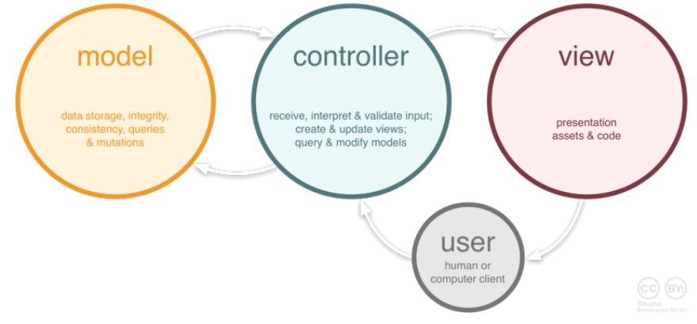
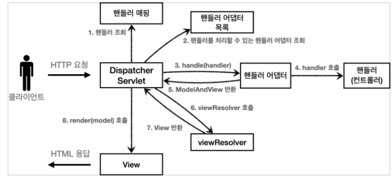
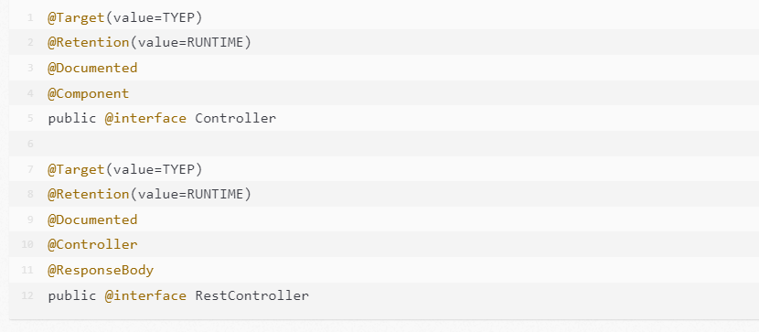
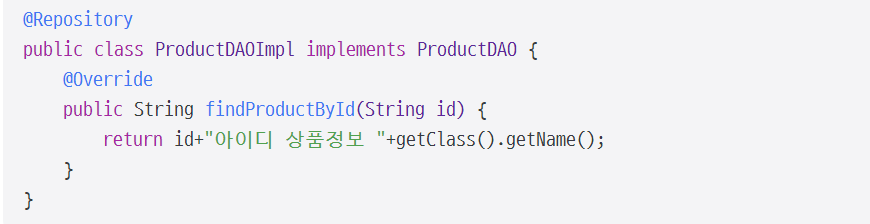

# 1. MVC 패턴
### \#디자인 패턴(복습)

    -프로그램이나 어떤 특정한 것을 개발하는 중에 발생했던 문제점들을 정리
    ->상황에 따라 간편하게 적용해서 쓸 수 있는 것을 정리
    -> 특정한 "규약"을 통해 쉽게 쓸 수 있는 형태로 만든 것
## 1-1.MVC 패턴
### MVC  
    -디자인패턴 중 하나
	- Model, View, Controller의 약자  
	- 하나의 애플리케이션, 프로젝트를 구성할 때 그 구성요소를 세가지의 역할로 구분한 패턴
	
### 패턴의 흐름										
    사용자가 controller를 조작  
    -> controller는 model을 통해서 데이터를 가져옴  
    -> 그 정보를 바탕으로 시각적인 표현을 담당하는 View를 제어  
    -> 사용자에게 전달

## 1-2. 모델, Model

    - 애플리케이션의 정보, 데이터를 나타냄
    - 데이타베이스, 처음의 정의하는 상수, 초기화값, 변수 등
    - 혹은 이러한 데이터, 정보들의 가공을 책임지는 컴포넌트

### 모델의 규칙

1. 사용자가 편집하길 원하는 모든 데이터를 가지고 있어야 함  
> ex) 화면안의 네모박스에 글자가 표현됨  
> 
>- 네모박스의 화면 위치 정보, 네모박스의 크기정보, 글자내용, 글자의 위치, 글자의 포맷 정보 등을 가지고 있어야 함

2. 뷰나 컨트롤러에 대해서 어떤 정보도 포함되면 X

> 데이터 변경이 일어났을 때 모델에서 화면 UI를 직접 조정해서 수정할 수 있도록 뷰를 참조하는 내부 속성값을 가지면 안 됨

3. 변경사항 존재 시, 변경 통지에 대한 처리방법 구현  
>   -모델의 속성 중 텍스트 정보 변경  
>   -이벤트를 발생시켜 누군가에게 전달 + 모델 변경 요청 이벤트 전송시 이를 수신할 수 있는 처리 방법을 구현  
>   -또한 모델은 재사용가능해야 하며 다른 인터페이스에서도 변하지 않아야 함. 

## 1-3. 뷰, View

    -input 텍스트, 체크박스 항목 등과 같은 사용자 인터페이스 요소
    ==> 데이터 및 객체의 입력, 그리고 보여주는 출력 담당
    -데이터를 기반으로 사용자들이 볼 수 있는 화면  

### 뷰의 규칙   

1. 모델이 가지고 있는 정보를 따로 저장 X

>   화면에 글자를 표시 하기 위해, 모델이 가지고 있는 정보를 전달받음  
>   정보 유지를 위해서 임의의 뷰 내뷰에 저장 X

2. 모델이나 컨트롤러와 같은 다른 구성요소에 대한 정보 X

>   다른 요소는 참조하거나 어떻게 동작하는지에 대한 정보 X  
>   뷰 == 데이터를 받으면 화면에 표시해주는 역할만

3. 변경이 일어나면 변경통지에 대한 처리방법을 구현해야만 한다.

>   변경 사항 발생시 해당 변경을 알려줘야 하는 방법을 구현이 필요  
>   뷰 ==> 화면에서 사용자가 화면에 표시된 내용을 변경 ==> 모델에 전달 필요  
>   변경 통지 구현

#### 재사용가능 + 다른 정보 표현에 용이하게 설계 

## 1-4. 컨트롤러, controller

>   데이터와 사용자인터페이스 요소들을 잇는 다리역할   
>   ==> 사용자가 데이터를 클릭 + 수정하는 것에 대한 "이벤트"들을 처리하는 부분  

### 컨트롤러의 규칙 

1. 모델이나 뷰에 대한 정보 O
>   모델이나 뷰는 서로의 존재를 모르고, 변경을 외부로 알리고, 수신하는 방법 존재
>   이를 컨트롤러가 중재하기 위해 모델, 뷰에 대한 정보 O 

2. 모델이나 뷰의 변경을 모니터링

>   모델이나 뷰의 변경 통지 수신
>   ->해석, 각 구성 요소에게 통지 

>   애플리케이션의 메인 로직은 컨트롤러가 담당 

# 2. Spring Boot에 대한 이해
## 2-1. Spring과 Spring Boot
### 기존 Spring 설정의 문제점
>   설정이 매우 복잡  
>   -> 스프링 부트 출시

### 스프링 부트
>   ==프레임워크 쉽고 빠르게 이용할 수 있게 해주는 도구  
> 빠른 스프링 프로젝트 설정  
>>  의존성 세트(스타터) -> 간단하게 의존성 사용 혹은 관리  
>>  스프링에 속한 도구

_**==> 개발자가 비즈니스 로직에만 더 집중적으로 개발할 수 있게해주는 도구**_ 

## 2-2. Spring과 Spring Boot의 차이점

###    1) 목적   
>Spring
>> - 엔터프라이즈 애플리케이션 개발의 용이  
> 
>Spring Boot
>> - 스프링 개발을 더 빠르게

###    2) 구성의 차이   
>Spring
>> - 앱 개발에 필요한 환경 수동으로 구성, 정의  
> 
>Spring Boot
>> - 스프링 코어, 스프링 MVC 자동으로 로드

### 3) 내장 WAS 유무

### \# WAS  
-> 웹 애플리케이션 실행하기 위한 장치

>Spring  
>>  - 일반적으로 톰캣과 같은 WAS에서 배포  
> 
>Spring Boot  
>> - 자체 WAS 존재  
>> - jar파일 생성시 별도의 WAS 설정 X  
>> - 톰캣, 제티, 언더토우 존재 (상황에 따라 필요한 WAS 선택 가능)  

###    4) XML
>Spring
>> - 일부 파일은 XML로 직접 생성, 관리  
> 
>Spring Boot
>> - 사용하지 않음

###    5) 인메모리 데이터베이스 지원
>Spring
>> - 지원하지 않음      
> 
>Spring Boot
>> - 인메모리 데이터베이스 자동 설정 지원

# 3. 로깅에 대한 이해
## 3-1. 로깅(logging)

>   - 시스템 콘솔을 사용해서 필요한 정보를 출력하거나 디버깅하지 X   
>별도의 logging 라이브러리를 사용하여 디버깅이나 타임스탬프 등 정해진 양식에 맞추어 화면 상이나 파일 로그를 남김  
>   - System.out.println()와 유사한 역할

### \# logging의 장점
>1. 스레드 정보, 클래스 이름 같은 부가 정보를 함께 볼 수 있고, 출력 모양 조정 가능 
>2. 로그 레벨에 따라 개발서버에서는 모든 로그를 출력하고, 운영서버에서는 출력하지 않는 등 로그를 상황에 맞게 조절 가능 
>3. 시스템 아웃 콘솔에만 출력하는 것이 아니라, 파일이나 네트워크 등, 로그를 별도의 위치에 남길 수 있음
>4. 파일로 남길 때에는 일별, 특정 용량에 따라 로그 분할이 가능
>5. println을 썼을 때보다 내부 버퍼링, 멀티 스레드 등의 환경에서 유리

### \# System.out.println의 단점
>1. 휘발성  
>>- System.out.println() 은 로그가 표준 출력으로 출력됨  
>>- 파일로 저장되지 않고 휘발됨   
>>  -   로그는 에러가 발생한 상황을 기록하고, 추후 확인하여 문제를 진단하고, 재현하고, 고치기 위해 사용
>>     - 표준 출력으로 한번 출력되고 어디에도 저장되지 않으면 로그의 역할 수행 X

_** ==> 로그된 데이터는 실제로 기록되어야 함. System.out.println() 만으로는 불가능**_

>2. 에러 발생 시 추적할 수 있는 최소한의 정보 X  
>> - System.out.println() 은 인자로 전달한 문자열만을 출력  
>> - 문제가 발생한 날짜, 시각 그리고 문제의 수준, 로그가 발생한 위치 등 최소한의 정보가 기록되지 않음
>> - 추가적인 정보를 제공하지 않는 다음에야 문제 해결이 힘듦.

>3. 로그 출력 레벨 사용 X  
>> 로컬에서 개발할 때에는 디버깅을 위한 아주 상세한 정보가 출력되어 확인할 수 있어야함
>> 프로덕션에서 동작하는 코드의 경우
>> - 에러/장애가 발생할 때 문제를 진단할 수 있는 정보만 필요
>> - 개발시에만 사용되는 정보와 문제 상황에 대한 정보가 함께 로깅된다면 문제 해결을 위한 정작 중요한 정보를 얻기 힘듧

## 3-2. @slf4j annotation

> ### SLF4J?
>> - LogBack이 바로 SL4J의 Native 구현체
>> - SLF4J를 사용하여 로깅 처리를 하면 실제 로그는 LogBack에서 출력하게 됨
>>   - LogBack : log4j를 토대로 새롭게 만든 Logging 라이브러리

기존 방식
- 클래스를 생성할 때마다 항상 로그를 남기기 위해 Logger 변수를 선언해야 함  

SLF4J annotation  
- Lombok의 @Slf4j 어노테이션 사용 시 자동으로 log 변수를 선언하여 편리하게 log 찍기 가능  
- @Slf4j 선언하여 사용할 경우 변수명이 log로 고정됨  
- SLF4J는 다양한 라이브러리들을 하나의 통일된 방식으로 사용할 수 있는 방법을 제공  
- 어플리케이션은 로깅 라이브러리를 어떤 것을 사용하던지 같은 방법으로 로그를 남길 수 있게함.
- 로그 라이브러리를 교체하더라도, 어플리케이션의 코드는 변경될 필요가 없음.

# 4. Spring MVC
## 4-1. Spring MVC 요청 처리 흐름

>1. 핸들러 조회 : 핸들러 매핑을 통해 URL에 매핑된 핸들러(컨트롤러)를 조회
>2. 핸들러 어댑터 조회 : 핸들러를 실행할 수 있는 핸들러 어댑터를 조회
>3. 핸들러 어댑터 실행 : 핸들러 어댑터를 실행
>4. 핸들러 실행 : 핸들러 어댑터가 실제 핸들러를 실행
>5. ModelAndView 반환 : 핸들러 어댑터는 핸들러가 반환하는 정보를 ModelAndView로 변환하여 반환
>6. viewResolver 호출 : ViewResolver를 찾고 실행
>7. View 반환 : ViewResolver는 뷰의 논리 이름을 물리 이름으로 바꾸고, 렌더링 역할을 담당하는 뷰 객체를 반환
>8. 뷰 렌더링 : 뷰를 통해 뷰를 렌더링
>
>
>
> 

## 4-2. @Controller, RestController
- Spring에서 컨트롤러를 지정해주기 위한 어노테이션 
- 전통적인 Spring MVC 컨트롤러인 @Controller
- RESTful 웹 서비스의 컨트롤러인 @RestController 

>HTTP Response Body가 생성되는 방식  
>> - @Controller의 역할은 Model 객체를 만들어 데이터를 담고 View를 반환  
>> - @RestController는 단순히 객체만을 반환하고 객체 데이터는 JSON 또는 XML 형식으로 HTTP 응답에 담아 전송  

## \# @Controller, RestController 차이점
>> 1. @Controller
>>    - 클래스를 Spring MVC 컨트롤러로 표시하는데 사용   
>> 2. @RestController
>>    - RESTful 웹 서비스에서 사용되는 특수 컨트롤러, @Controller + @Response와 동일
>> 3. @RestController를 표시하면 모든 메소드가 뷰 대신 객체로 작성됨
>> 4. @Controller는 @Component 주석이 달려있고, @RestController는 아래와 같이 @Controller와 @ResponseBody 주석이 달린 편의 컨트롤러
>
>

## 4-3. @Service
> 비즈니스 로직을 포함하는 클래스를 스프링 빈으로 등록하려 할 때 사용

@Service는 @Component를 상속받아 작성  
특정 계층을 나타내기 위해 사용 스프링 컨테이너는 @Service가 붙은 클래스를 찾아서 빈으로 등록  
==> 컴포넌트 스캔(Component Scan)

 
- 위 예제에서 MyService 클래스는 비즈니스 로직을 포함하며 @Service 어노테이션이 붙어 있어서 스프링 컨테이너에 의해 관리됨  
- MyService는 MyRepository 클래스와 협력하여 데이터를 가져오는 기능을 제공
- @Autowired 어노테이션을 사용하여 MyRepository 인스턴스를 주입받고, 이를 통해 fetchData() 메서드에서 데이터를 가져옴
- @Service는 일반적으로 비즈니스 로직을 포함하는 클래스에 사용

## 4-4. @Repository
> - 데이터 액세스 계층(Data Access Layer)에서 데이터베이스와의 상호작용을 담당하는 클래스에 적용  
>   - 주로 데이터 액세스 객체(Data Access Object, DAO)를 구현하는 클래스에 적용
> - 해당 클래스를 스프링의 예외 변환 및 롤백 등의 데이터 액세스 예외 처리와 함께 빈(Bean)으로 등록하는 역할

Data Access Object 나 Persistence Layer에 명시

  

### \# **Persistence Layer**  
>- 데이터를 영구적으로 저장하고 관리함으로써 데이터의 지속성을 보장 
>- 데이터베이스와의 상호작용을 담당
>  - 데이터베이스와의 통신
>  - 데이터의 CRUD(Create, Read, Update, Delete) 작업
>  - 데이터베이스 트랜잭션 관리 등을

enablejparepository

jparepository