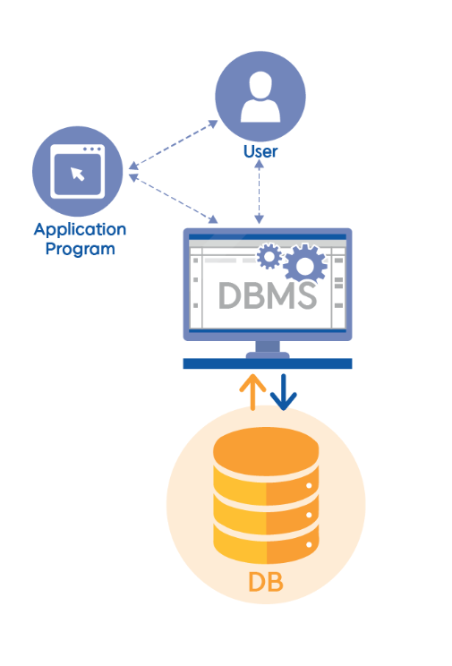

# 데이터베이스
## 데이터베이스(DB)란?
> - 구조화된 정보 또는 데이터의 조직화된 모음  
> - 일반적으로 컴퓨터 시스템에 전자적으로 저장  
> - 데이터베이스 관리 시스템(DBMS)에 의해 제어  
> - 연결된 애플리케이션 + 데이터 + DBMS ==> 데이터베이스 시스템(데이터 베이스)
> - 일반적으로 처리 및 데이터 쿼리를 효율적으로 수행하기 위한 테이블(행과 열)로 모델링  
> - 데이터에 쉽게 액세스하고 관리, 수정, 업데이트, 제어 및 구성  
> - 대부분의 데이터베이스는 데이터 작성 및 쿼리에 SQL(Structured Query Language)을 사용

### # DBMS?
> - DB에 접근하여 데이터베이스 정의, 조작, 제어 등 DB 관리를 지원하며 DB를 보호하고 보안을 제공하는 소프트웨어

> #### 1. 정의
>> - DB스에 저장될 자료의 구조, 응용 프로그램에서 이 구조를 이용하는 방식을 정의하는 기능  
>> - 레코드 구조의 정의, 데이터 모형의 정의, 물리적 구조의 정의 등을 포함  
>#### 2. 조작
>> - 사용자의 요구에 따라 DB에 접근하여 저장된 자료를 검색, 갱신, 삽입, 삭제할 수 있도록 하는 기능
>> - 쉽고, 명확하고 효율적인 데이터 언어(data language)로 DB 데이터 조작
>#### 3. 제어
>> - 데이터를 조작하려는 작업이 데이터 무결성(data integrity)을 파괴하지 않도록 작업 요청을 제어하는 기능
>> - 접근하는 사용자의 권한을 검사하여 보안 유지
>> - 여러 사용자가 데이터베이스에 동시에 접근하여 데이터를 처리할 경우 처리 결과가 항상 정확성을 유지하도록 함

#### * 장점  
- 데이터 일관성(consistency), 무결성(integrity), 보안성(security) 등
#### * 단점 
- 고가의 운영 비용, 복잡한 자료 처리를 위한 전문 인력의 필요, 시스템 취약성 등
- 목적에 따라 비용과 기술적 요구사항들을 면밀히 고려하여 용도에 맞게 도입해야 함
- 백업(backup)과 같은 예비조치나 사후 회복(recovery) 대책 등을 데이터베이스 관리 시스템 도입 계획에 포함하여 수립해야 함

### SQL?
> - 관계형 데이터베이스에 정보를 저장하고 처리하기 위한 프로그래밍 언어
> - 관계형 데이터베이스는 정보를 표 형식으로 저장, 행과 열은 다양한 데이터 속성과 데이터 값 간의 다양한 관계를 나타냄
> - SQL 문을 사용하여 데이터베이스에서 정보를 저장, 업데이트, 제거, 검색 및 검색, 데이터베이스 성능 유지 관리하고 최적화

## DB 자료형(데이터 타입)   (MYSQL의 경우)
### 종류
### *1. 숫자형*
| **Data Type**                                 | **Description**                                                    |  
|-----------------------------------------------|--------------------------------------------------------------------|
| BIT(size)	                                 | 비트 값 유형 / n은 값 당 bit 수를 나타내며 1~64 사이의 값                            |
| TINYINT(size)                                 | 	정수형 데이터 타입(1byte) -128 ~ +127 또는 0 ~ 255수                         |
| BOOL BOOLEAN                              | 0은 거짓으로 간주되고 0이 아닌 값은 참으로 간주                                       |
| SMALLINT(size)                                | 	정수형 데이터 타입(2byte) -32768 ~ 32767 또는 0 ~ 65536수                    |
| MEDIUMINT(size)	                             | 정수형 데이터 타입(3byte) -8388608 ~ +8388607 또는 0 ~ 16777215수             |
| INT(size) INTEGER(size)                   | 정수형 데이터 타입(4byte) -2147483648 ~ +2147483647 또는 0 ~ 4294967295수|
| BIGINT(size)                                  |	정수형 데이터 타입(8byte) - 무제한 수|
| FLOAT(size, d)                                |	부동 소수형 데이터 타입(4byte) -고정 소수점을 사용 형태이다.|
| FLOAT(p)	                                     |부동 소수점 숫자 / p는 비트 정밀도를 가리키지만, MySQL은 결과 데이터 타입으로 FLOAT 또는 DOUBLE을 사용할 지를 결정할 때에만 이 값을 사용|
| DOUBLE(size, d) DOUBLE PRECISION(size, d) |부동 소수형 데이터 타입(8byte) -DOUBLE을 문자열로 저장 size는 전체 자릿수(Precision : 정밀도), d는 소수점 뒷자리수(Scale : 배율)|
| DECIMAL(size, d) DEC(size, d)             |고정 소수형 데이터 타입고정(길이+1byte) -소수점 사용 형태|

### *2. 문자열*
| **Data Type**                 | **Description**                                                                 |  
|-------------------------------|---------------------------------------------------------------------------------|
| CHAR(size)                    | 	고정 길이 데이터 타입(최대 255byte) 지정된 길이보다 짦은 데이터 입력될 시 나머지 공간 공백으로 채워진다.           |
| VARCHAR(size)	             | 가변 길이 데이터 타입(최대 65,535byte)  지정된 길이보다 짦은 데이터 입력될 시 나머지 공간은 채우지 않는다.         |
| TINYTEXT	                     |  문자열 데이터 타입(최대 255byte)                                                         |
| TEXT(size)	                 | 문자열 데이터 타입(최대 65,535byte)                                                       |
| MEDIUMTEXT	                 | 문자열 데이터 타입(최대 16,777,215byte)                                                   |
| LONGTEXT	                     | 문자열 데이터 타입(최대 4,294,967,295byte)                                                |
| ENUM(val1, val2, val3, ...)	 | 열거형 / 정해진 몇가지의 값들 중 하나만 저장,  최대 65,535개의 개별 값을 가질 수 있고, 내부적으로 정수 값으로 표현됩니다. |
| SET(val1, val2, val3, ...)	 | 집합형 / 정해진 몇가지의 값들 중 여러 개를 저장, 최대 64개의 요소로 구성될 수 있고, 내부적으로 정수 값으로 표현됩니다.     |

### *3.날짜*
| **Data Type**  | **Description**                                                                                 |  
|----------------|-------------------------------------------------------------------------------------------------|
| DATE	          | 날짜(년도, 월, 일) 형태의 기간 표현 데이터 타입(3byte) Format: YYYY-MM-DD                                     |
| DATETIME(fsp)  | 날짜와 시간 형태의 기간 표현 데이터 타입(8byte) Format: YYYY-MM-DD hh:mm:ss                                  |
| TIMESTAMP(fsp) | 날짜와 시간 형태의 기간 표현 데이터 타입(4byte)시스템 변경 시 자동으로 그 날짜와 시간 저장 '1970-01-01 00:00:00' UTC 이후 경과된 초 수를 저장 |
| TIME(fsp)	  | 시간(시, 분, 초) 형태의 기간 표현 데이터 타입(3byte) Format: hh:mm:ss                                        |
| YEAR	          | 년도 표현 데이터 타입(1byte)  2자리 또는 4자리 형식으로 연도를 저장합니다. 범위 70~69, 1970~2155년|                       

### *4. 이진*
| **Data Type**   | **Description**                                                                  |  
|-----------------|----------------------------------------------------------------------------------|
| BINARY(size)	   | CHAR()와 같으나 이진 바이트 문자열을 저장 크기 매개 변수는 열 길이를 바이트 단위로 지정(최대 255byte)            |
| VARBINARY(size) | VARCHAR()와 같으나 이진 바이트 문자열을 저장 size 매개 변수는 최대 열 길이를 바이트 단위로 지정(최대 65,535byte) |
| TINYBLOB	       | 이진 데이터 타입 (최대 255byte)                                                           |
| BLOB(size)      | 	대용량의 바이너리 데이터를 저장(실제로 저장하진 않지만, 이미지파일도 저장가능)(최대 65,535byte)                     |
| MEDIUMBLOB	   | 이진 데이터 타입 (최대 16,777,215byte)                                                    |
| LONGBLOB        | 이진 데이터 타입 (최대 4,294,967,295byte)                                                 |

## 관계형 데이터베이스란? (RDB)
### 정의
> - 데이터가 하나 이상의 열과 행의 테이블(또는 '관계')에 저장  
> - 서로 다른 데이터 구조가 어떻게 관련되어 있는지 쉽게 파악하고 이해할 수 있도록 사전 정의된 관계로 데이터를 구성하는 정보 모음  
> - 관계 - 이러한 테이블 간의 상호작용을 기반으로 설정되는 여러 테이블 간의 논리적 연결

### 모델
> - 비즈니스에서 데이터를 구성, 관리, 연결하는 데 도움이 되는 스프레드시트 파일 모음  
> - 관계형 데이터베이스 모델에서 각 '스프레드시트'는 열(속성)과 행(레코드 또는 튜플)으로 대표되는 정보를 저장하는 테이블

### 속성(열)
> - 데이터 유형을 지정하며 각 레코드(또는 행)는 구체적인 데이터 유형의 값을 포함
> - 관계형 데이터베이스의 모든 테이블에는 행에서 고유하게 식별 가능한 '기본 키'라는 속성이 존재
> - 외래 키(다른 기존 테이블의 기본 키를 참조)를 사용하여 각 행에서 서로 다른 테이블 간의 관계 형성이 가능

## 비관계형 데이터베이스란?
### 정의
> - 대부분의 전형적인 데이터베이스 시스템에서 찾을 수 있는 행과 열로 이루어진 테이블 형식 스키마를 사용하지 않는 데이터베이스  
> - 저장되는 데이터 형식의에 맞게 최적화된 스토리지 모델을 사용
> - ex) 단순 키/값 쌍, JSON 문서 또는 모서리와 꼭짓점으로 이루어진 그래프
> - NoSQL이라고도 함

## RDB, NoSQL의 차이
### 구조
>**관계형 데이터베이스**
>>- 데이터를 테이블 형식으로 저장하며 데이터 변형 및 테이블 관계에 관한 엄격한 규칙을 따름
>>- 데이터 무결성과 일관성을 유지하면서 정형 데이터에 대한 복잡한 쿼리를 처리할 수 있음  
>
>**비관계형 데이터베이스**
>> - 유연하며, 요구 사항이 변화하는 데이터에 보다 유용한 경우
>>- 이미지, 비디오, 문서 및 기타 반정형 및 비정형 콘텐츠를 저장하는 데 사용할 수 있습니다.

### 데이터 무결성 메커니즘  
>>- 원자성, 일관성, 격리 및 내구성(ACID)  
>>==> 데이터 처리에서 오류나 중단이 발생하더라도 데이터 무결성을 유지할 수 있는 데이터베이스의 기능
>
>**관계형 데이터베이스**
>>- 엄격한 ACID 속성을 따라 일련의 후속 작업이 항상 함께 완료됨  
>>- 단일 작업이 실패하면 전체 작업 세트가 실패 처리  
>>==> 데이터 정확성이 항상 보장
>
>**비관계형 데이터베이스**
>>- 기본적으로 가용성이 보장되고 소프트 상태이며 궁극적으로 일관된(BASE) 보다 유연한 모델을 제공
>> - 가용성을 보장하지만 즉각적인 일관성은 보장하지 않음
>> - 데이터베이스 상태는 시간이 지남에 따라 변할 수 있으며 결국 일관된 상태가 됨
>> ===>일부 비관계형 데이터베이스는 ACID 규정 준수와 성능 또는 기타 장단점을 가질 수 있음

### 성능
>> **관계형 데이터베이스**
>> - 디스크 하위 시스템에 따라 달라짐
>> - SSD를 사용하고 디스크를 Redundant Array of Independent Disks(RAID)로 구성하여 디스크를 최적화하면 데이터베이스 성능을 높일 수 있음
>> - 성능을 극대화하려면 인덱스, 테이블 구조 및 쿼리도 최적화해야 함
>
>> **비관계형 데이터베이스**  
>> - 네트워크 지연 시간, 하드웨어 클러스터 크기 및 호출 애플리케이션에 따라 달라짐
>
>#### Raid?
>>  - 여러 개의 하드 디스크에 일부 중복된 데이터를 나눠서 저장하는 기술
>
>#### 비관계형 데이터베이스 성능 향상 방법
> 
>1.클러스터 크기 증대  
> 2.네트워크 지연 시간 최소화  
> 3.인덱스 및 캐시   
> 
> ==> 비관계형 데이터베이스는 특정 사용 사례에서 관계형 데이터베이스보다 더 높은 성능과 확장성을 제공

### 확장
>> **관계형 데이터베이스**
>> - 엄격한 스키마는 대규모 환경에서 문제 야기
>> - 일반적으로 수직적으로 규모를 조정할 때는 서버에 CPU 또는 RAM 리소스를 추가
>> - 읽기 전용 워크로드를 처리하기 위해 서버 간에 데이터를 복제하여 수평적으로 규모를 조정할 수도 있음
>> - 파티셔닝 및 샤딩과 같은 특수한 전략이 필요합니다.  
>
>> - **비관계형 데이터베이스**
>> - 뛰어난 확장성
>> - 워크로드를 여러 노드에 보다 손쉽게 분산
>> - 더 작은 세트로 분할하고 여러 노드에 세트를 분산하여 대량의 데이터를 처리할 수 있습니다.

# 관계형 데이터베이스(RDB)
## Entitiy?
- 데이터 모델링에서 사용되는 객체
- 업무에 필요하고 유용한 정보를 저장하고 관리하기 위한 "어떤 것(Thing)
### 적절한 Entitiy의 특징
1. 업무에서 필요로 하는 정보
>- 엔터티는 반드시 시스템을 구축하고자 하는 업무에서 필요로 하고 관리하고자 하는 정보여야만 함
2. 유일한 식별자
>- 어떤 엔터티에 업무적으로 의미를 가지는 인스턴스가 식별자에 의해 한 개씩만 존재하는지 검증해 보아야 함
>- ex)회원 ID, 계좌번호
3. 두 개 이상의 인스턴스의 집합
>- 인스턴스의 집합이 되어야 함. 여기서 집합은 한 개가 아니라 반드시 두 개 이상일 때 집합
4. 업무 프로세스에 의해 이용
>- 고립된 엔터티의 경우(생성은 되었지만 사용하지 않는 entity 등)는 엔터티를 제거하거나 아니면 누락된 프로세스가 존재하는지 살펴보고 해당 프로세스를 추가해야 함
5. 반드시 속성을 포함해야 함
>- 속성을 포함하지 않는 엔터티  
>==> 관계가 생략되어 있거나 업무 분석이 미진하여 속성 정보가 누락되는 경우에 주로 발생
>- 마찬가지로 주식별자만 존재하고 일반속성은 전혀 없는 경우도 마찬가지로 적절한 엔터티라고 할 수 없음.
>- 단, 예외적으로 관계엔터티(Associative Entity)의 경우에만 주식별자 속성만 가지고 있어도 엔터티로 인정
6. 다른 엔터티 간의 관계가 존재해야 함
>- 엔터티는 다른 엔터티와 최소 한 개 이상의 관계가 존재해야 함
>- entity가 도출되었다  
>==>해당 업무 내에서 업무적인 연관성(존재적 연관성, 행위적 연관성)을 가지고 다른 엔터티와의 연관의 의미를 가지고 있음을 나타냄

## Table?
>-  자료의 구조를 2차원의 표로 나타낸 데이터 모음
> - Row(행), Column(Field, 열)

### Row
> - 레코드(record) 또는 튜플(tuple)
> - 어떤 테이블에서의 단일 구조 데이터 항목
> - 일련의 관련 자료를 나타내며, 테이블에서 모든 로우는 동일한 구조를 가지고 있음

### Column
> - 특정한 단순 자료형의 일련의 데이터값과 테이블에서의 각 열
> - 열이 어떻게 구성되어야 할 지에 대한 구조를 제공한다.
> - 속성(attribute)과 동일  
> 
> - 필드(field)
>   - 필드, 필드값은 한 열이나 한 컬럼 사이의 교차로 존재하는 특정한 단일 항목

## 기본키(Primary Key), 외래키(Foreign Key)
### 기본키 식별키, Primary Key (PK)
- 테이블의 유일한 값을 가지는 필드
- 데이터의 중복이 없는 식별가능한 필드를 선정
- 테이블 1개당 PK 필드 1개 이상 (권장)
- 중복 , null , 공백은 사용불가
- 해당 PK필드는 다른테이블의 필드에서 참조
- not null + unique 속성
- ex) 주민번호, 학번, ISBN(책번호) , 상호코드 등등

### 참조키 외래키 Foreign Key (FK)
- 다른 테이블의 PK필드와 연결
- FK 필드명은 PK 필드명과 동일하게 사용 (권장)
- FK필드의 타입은 PK필드의 타입과 동일 (필수)
- 참조하는 테이블에서 FK 필드 선언 ( 1:M 관계에서 M쪽이 참조하는 테이블 )
- 중복 , null 가능
- ex) 점수테이블(접수자) , 출결(출근한사번) , 각종 서류(주민등록) , 대여(ISBN) , 재고관리(상호코드) 등등
- 
# 데이터베이스 명령어
> - SQL을 통해 데이터베이스의 데이터를 관리함

## 1. 데이터 정의 언어(DDL: Data Definition Language)
- 테이블과 컬럼을 정의하는 명령어로 생성, 수정, 삭제 등의 데이터 전체 골격을 결정하는 역할
- DDL은 명령어를 입력하는 순간 작업이 즉시 반영(Auto Commit)되기 때문에 사용할 때 주의

| 명령어     | 내용               |
|-----------|------------------|
| CREATE    | 테이블을 생성하는 역할     |
| ALTER	 | 테이블의 구조를 수정하는 역할 |
| DROP	     | 테이블을 삭제하는 역할     |
| RENAME	 | 테이블을 이름을 변경하는 역할 |
| TRUNCATE	 | 테이블을 초기화하는 역할    |

### CREATE 규칙
>1. 객체를 의미하는 것이므로 단수형으로 이름을 짓는걸 권고
>2. 유일한 이름으로 명명
>3. 테이블 내의 컬럼명 또한 중복되지 않는 유일한 이름으로 명명
>4. 정의할 때 각 컬럼은 ,으로 구분하며 테이블 생성문의 마지막은 ;
>5. 컬럼명은 데이터 표준화 관점에서 일관성 있게 사용
>6. 컬럼 뒤에 데이터 유형을 반드시 지정
>7. 테이블과 컬럼명은 반드시 문자로 시작
>8. 대소문자 구분을 하지 않지만, 기본적으로 대문자

### ALTER: 컬럼 변경 문법

| 명령어	      | 내용                      |
|----------------|-------------------------|
| ADD COLUMN	  | 컬럼을 추가하는 역할             |
| DROP COLUMN	  |  컬럼을 삭제하는 역할            |
| MODIFY COLUMN  | 컬럼을 수정하는 역할             |
| RENAME COLUMN  | 컬럼 이름을 변경하는 역할          |
| DROP CONSTRAIN | 	컬럼을 제약조건을 기반해서 삭제하는 역할 |

## 2. 데이터 조작 언어(DML:Data Manipulation Language)
> -데이터베이스의 내부 데이터를 관리하기 위한 언어
> - 데이터를 조회, 추가, 변경, 삭제 등의 작업을 수행하기 위해 사용

### 특징
- DDL과 달리 DML은 적는 즉시 반영(Auto Commit)이 되지 않음  
===> DML에 의한 데이터 변동은 영구적인 변경이 아니기 때문에 ROLLBACK으로 다시 되돌릴 수 있음
- DML은 Target 테이블을 메모리 버퍼 위에 올려두고 변경을 수행하기 때문에, 실시간으로 테이블에 반영되지 않음
===> Commit 명령어를 통해 Transaction을 종료해야 해당 변경 사항이 테이블에 반영됨

| 명령어     | 내용                       |
|-----------|--------------------------|
| SELECT	 | 데이터베이스에서 데이터를 검색하는 역할    |
| INSERT	 | 테이블에 데이터를 추가하는 역할        |
| UPDATE	 | 테이블 내에 존재하는 데이터를 수정하는 역할 |
| DELETE    | 테이블에서 데이터를 삭제하는 역할       |

## 3. 데이터 제어 언어(DCL:Date Control Language)
>- 데이터를 관리 목적으로 보안, 무결성, 회복, 병행 제어 등을 정의하는데 사용
>- 데이터베이스에 접근하여 읽거나 쓰는 것을 제한할 수 있는 권한을 부여하거나 박탈
>- 트랜잭션을 명시하거나 조작

### 특징
- 불법적인 사용자로부터 데이터를 보호하기 위한 데이터 보안의 역할을 수행
- 데이터의 정확성을 위한 무결성을 유지
- 시스템 장애에 대비한 회복과 병행수행을 제어

| 명령어   |내용|
|---------|---|
| GRANT   |권한을 정의할때 사용하는 명령어|
| REVOKE  |권한을 삭제할때 사용하는 명령어|

## COMMIT, ROLLBACK
Commit
- 모든 작업들을 정상 처리하겠다고 확정하는 명령어
- 해당 처리 과정을 DB에 영구 저장하겠다는 의미
- Commit을 수행하면 하나의 트랜잭션 과정이 종료
- Commit을 수행하면 이전 데이터가 완전히 반영되어 UPDATE

Roll-back
- 작업 중 문제가 발생되어 트랜잭션의 처리 과정에서 발생한 변경사항을 취소하는 명령어
- 해당 명령을 트랜잭션에게 하달하면, 트랜잭션은 시작되기 이전의 상태로 되돌아감
- 마지막 Commit을 완료한 시점으로 돌아감 
==> Rollback은 Commit하여 저장한 예전 상태를 복구하는 것