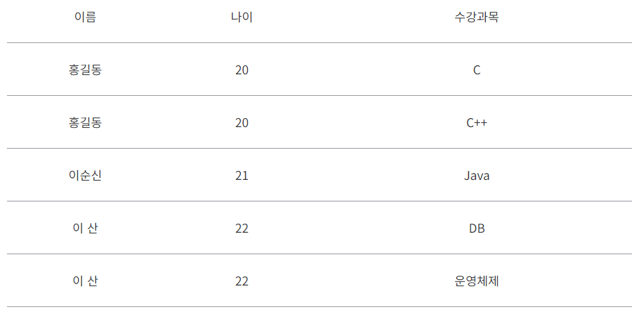

# 1. 정규화란?
## 1-1. 목적
> - 이상현상이 있는 릴레이션을 분해하여 이상현상을 없애는 과정  
> - 이상현상이 존재하는 릴레이션을 분해하여 여러 개의 릴레이션을 생성
> - 이를 구분하여 정규형이 높아질수록 이상현상은 줄어들게 됨.

### * 이상 현상?
> - 테이블을 설계할 때 잘못 설계하여 데이터를 삽입, 삭제, 수정할 때 논리적으로 생기는 오류
> - 갱신 이상(Modification ANomaly), 삽입 이상(Insertion Anomaly), 삭제 이상(Deletion Anomaly)

### -요약- 
> **- 테이블 간에 중복된 데이터를 허용하지 않는다는 것**  
> **- 무결성(Integrity) 유지, DB가 차지하는 저장 용량 감소**

## 1-2. 중요성
> - 테이블 설계는 데이터베이스의 기반을 이루며, 효율적인 테이블 설계는 시스템의 성능과 직결
>   - 정규화를 통해 데이터의 중복을 줄이고, 데이터 간의 관계를 명확히 함
>   - 데이터베이스 성능 최적화  
>
> 
> - 올바른 테이블 설계 + 정규화  
>   => 데이터 무결성 유지 + 데이터베이스의 확장성과 유지보수성 향상    
>   ==> 장기적으로 데이터베이스 시스템의 안정성과 효율성을 보장  
>
> 
> - 데이터 모델링 과정에서도 중요한 역할
>   - 데이터 모델을 통해 비즈니스 요구사항을 분석하고, 이를 데이터베이스 구조로 옮기는 과정에서 정규화 원칙을 적용함으로써 효과적인 데이터 구조설계

# 정규화의 종류
## 1NF
> - 제 1 정규화
> - 테이블의 컬럼이 원자값(Atomic Value, 하나의 값)을 갖도록 테이블을 분해

> 규칙
> 
>> 1. 각 컬럼이 하나의 속성만을 가져야한다.
>> 2. 하나의 컬럼은 같은 종류나 타입(type)의 값을 가져야한다.
>> 3. 각 컬럼이 유일한 이름을 가져야한다.
>> 4. 칼럼의 순서가 상관없어야한다.
 
> ## before
>
> ## After
> 

## 2NF
> - 제 2정규화
> - 제1 정규화를 진행한 테이블에 대해 완전 함수 종속을 만족하도록 테이블을 분해하는 것
> - 완전 함수 종속 == 기본키의 부분집합이 결정자가 되어선 안된다는 것

> 규칙
> 
>> 1. 제 1정규화를 만족해야한다.
>> 2. 모든 컬럼이 부분적 종속(Partial Dependency)이 없어야함
>> 3. 모든 칼럼이 완전 함수 종속을 만족해야함

> ## before
>
> ## After
> 
> 
> ## 쉽게 설명한 이미지
> 

## 3NF 
> - 제 3정규화
> - 제 2정규화를 진행한 테이블에 대해 이행적 종속을 없애도록 테이블을 분해하는 것
> - 이행적 종속이라는 것은 A->B, B->C가 성립할 때 A->C가 성립되는 것을 의미

> 규칙
> 
> 1. 제 2 정규화를 만족해야함
> 2. 기본키를 제외한 속성들 간의 이행 종속성(Transitive Dependency)이 없어야함

> ## before
> 
> -학생코드 == 기본키  
> 1. zip column을 알면 Street, City, State를 결정할 수 있음  
> 2. 여러명의 학생들이 같은 Zip코드를 갖는 경우에 Zip코드만 알면 Street, City, State가 결정  
>  ==> 중복된 데이터가 생길 가능성  
> ## After
> 

## BCNF
> - 3차 정규화를 조금 더 강화한 버전
> - 이는 3차 정규화에서 해결할 수 없는 이상현상을 해결할 수 있음

> 규칙 
> 
> 1. 제 3 정규화를 만족해야 한다.
> 2. 모든 결정자가 후보키 집합에 속해야 한다.

> ## before
>
> ## After
>

# 반정규화
> - 데이터베이스의 성능 향상을 위하여, 데이터 중복을 허용하고 조인을 줄이는 데이터베이스 성능 향상 방법이다.
> - 반정규화는 조회(select) 속도를 향상시키지만, 데이터 모델의 유연성은 낮아진다.

## 수행하는 경우
1. 정규화에 충실하여 종속성, 활용성은 향상 되었지만 수행속도가 느려진 경우  
2. 다량의 범위를 자주 처리해야하는 경우
3. 특정 범위의 데이터만 자주 처리하는 경우  
4. 요약/집계 정보가 자주 요구되는 경우

## 절차

> 1. 반정규화의 대상을 조사
>> - 자주 사용되는 테이블에 접근(Access)하는 프로세스의 수가 많고 항상 일정한 범위만을 조회하는 경우
>> - 테이블에 대량의 데이터가 있고 대량의 데이터 범위를 자주 처리하는 경우에 처리범위를 일정하게 줄이지 않으면 성능을 보장할 수 없을 경우
>> - 통계성 프로세스에 의해 통계 정보를 필요로 할 때 별도의 통계테이블(반정규화 테이블) 생성
>> - 테이블에 지나치게 많은 조인(JOIN)이 걸려 데이터를 조회하는 작업이 기술적으로 어려울 경우

> 2. 반정규화의 대상에 대해 다른 방법으로 처리할 수 있는지 검토
>> - 지나치게 많은 조인(JOIN)이 걸려 데이터를 조회하는 작업이 기술적으로 어려울 경우 뷰(VIEW)를 사용
>> - 대량의 데이터처리나 부분처리에 의해 성능이 저하되는 경우에 클러스터링을 적용하거나 인덱스를 조정함으로써 성능을 향상
>> - 대량의 데이터는 Primary Key의 성격에 따라 부분적인 테이블로 분리(파티셔닝 기법, Partitioning)이 적용되어 성능저하를 방지
>> - 응용 애플리케이션에서 로직을 구사하는 방법을 변경함으로써 성능을 향상

> 3. 반정규화를 적용
>> - 테이블 반정규화
>> - 속성의 반정규화
>> - 관계의 반정규화

# 외래키(FK)와 연관관계
## 외래키(FK)
### 정의, 역할
> - 두 테이블을 서로 연결하는 데 사용되는 키
> - 다른 테이블의 Primary Key와 관련된 열
> - 외래키가 포함된 테이블을 자식 테이블이라고 함
> - 외래키 값을 제공하는 테이블을 부모 테이블이라 함

### 설정 방법, 주의점
> ### 1. 설정 방법
>>  FOREIGN KEY(기준 테이블과 연결된 참조테이블 컬럼명) REFERENCES 테이블명 (기준테이블 기본키 컬럼명)
>>
> ### 2. 주의 사항
>> 1) 외래키 값은 NULL이거나 부모 테이블의 기본키 값과 동일. (참조 무결성 제약조건)
>> 2) 부모 테이블의 기본키, 고유키를 외래키로 지정할 수 있음
>> 3) 부모 테이블의 기본키, 고유키가 여러개의 컬럼으로 이루어져 있다면 부모가 가진 기본키, 고유키 컬럼을 원하는 개수만큼 묶어서 외래키로 지정할 수 있음
>> 4) 외래키로 지정할 두 테이블의 필드는 같은 데이터 타입이어야 함

## 연관관계
> - 두 개 이상의 테이블 간에 존재하는 관계를 의미
### 일대일 (1:1)
> - 하나의 레코드가 다른 테이블의 레코드 한 개와 연결된 경우
> 

### 다대일 (N:1)
> - 데이터 테이블의 1, N 관계에서 외래 키는 항상 다쪽(N)에 있음
> - 양방향의 경우 항상 N 쪽이 연관관계의 주인
> 

### 다대다 (N:M)
> - 여러 개의 레코드가 다른 테이블의 여러 개의 레코드와 관계가 있는 경우
> - N:M 관계를 위해 스키마를 디자인할 때에는 Join 테이블을 만들어 관리
> - 1:N 관계와 비슷하지만, 양방향에서 다수의 레코드를 가질 수 있음
>

# CRUD와 조인
## CRUD 
> - 기본데이터베이스의 기본 4대 요소
> - 일반적으로 데이터베이스나 데이터 저장소에 수행되는 작업을 의미
> - 데이터에 대해 생성(Create), 읽기(Read), 갱신(Update), 삭제(Delete) 작업을 할 수 있는 방법의 약어  
>
> 
### 등록(Create), 조회(Read), 수정(Update), 삭제(Delete)
- Mysql을 기준으로 함

> #### 등록(Create)
> - 데이터베이스에서 INSERT문을 사용하여 테이블의 새 행을 하나 이상 추가
>>INSERT INTO 테이블명 (컬럼명1, 컬럼명2, ...) VALUES (데이터값1, 데이터값2, ...)
>> 
>>
>>insert into users (name, age) values ('eunbyeol', 33);
>
>>INSERT INTO 테이블명 VALUES (데이터값1, 데이터값2, ...)
>>
>>
>>insert into users
>>values ('tester', 123);

> #### 조회(Read)
> - 데이터베이스에서 SELECT문을 사용하여 테이블의 행을 선택
> - 조건을 이용하여 특정 조건에 맞는 행들만 선택
> - 선택된 테이블의 행들은 결과 셋(Result Set)으로 사용자에게 제시
>
>>SELECT	컬럼명 FROM	테이블명 [WHERE	조건]
>>
>> 
>> select * from users;
>>
>> select * from users where name = 'eunbyeol';

> #### 수정(update)
> - 데이터베이스에서 UPDATE문을 사용하여 기존 테이블에 존재하는 데이터의 값을 변경
> - 조건을 이용하여 특정 조건에 맞는 행들만 업데이트할 수도 있음
>> UPDATE	테이블명 SET	컬럼명1 = 데이터값1 WHERE	조건
>> 
>> 
>> update users set name = 'ko' where name = 'eunbyeol';

> #### 삭제(Delete)
> - 데이터베이스에서 DELETE문을 사용하여 기존 테이블에 존재하는 데이터의 값을 삭제
> - 조건을 이용하여 특정 조건에 맞는 행들만 삭제할 수도 있음
>> DELETE FROM 테이블명 WHERE 조건
>>
>>
>>delete from users where name = 'tester';
>>
>>select * from users;

## 조인 기본
> - 데이터를 가져올 때 하나의 테이블이 아니라 여러 개의 테이블에서 데이터를 가져와야하는 경우  
> ==> Join
> 
###  INNER JOIN, LEFT JOIN, RIGHT JOIN, FULL JOIN

> #### INNER JOIN
> - 교집합
>> - 테이블1 inner join 테이블2 on 조건;
>>
>>
>>SELECT * FROM	A inner join B on A.userId = B.userId;

> #### LEFT JOIN
> - 좌측 테이블의 경우
>> - 테이블1 left join 테이블2 on 조건;
>>
>>
>>SELECT * FROM	A left join B on A.postId = B.postId;
>>
>>
>>SELECT * FROM A left join B on A.postId = B.postId WHERE B.postId IS NULL;

> #### RIGHT JOIN
> - 우측 테이블의 경우
>> - 테이블1 right join 테이블2 on 조건;
>>
>>
>>SELECT * FROM	A right join B on A.postId = B.postId;
>>
>>
>>SELECT * FROM A right join B on A.postId = B.postId WHERE B.postId IS NULL;

> #### FULL JOIN
> - A, B 테이블 모두 필요할 때
> - ### MySQL에서는 full outer join을 지원하지 않아 right join과 left join을 합한것으로 쿼리를 짜야함
>>
>> - Mysql이 아닌 경우  
>> 
>> SELECT column_name(s) FROM table1 FULL OUTER JOIN table2 ON table1.column_name = table2.column_name;
>>
>> - ### **Mysql의 경우**  
>>
>> SELECT column_name(s) FROM table1 left join table2 ON table1.column_name = table2.column_name;  
>> union  
>> SELECT column_name(s) FROM table1 right join table2 ON table1.column_name = table2.column_name;   

