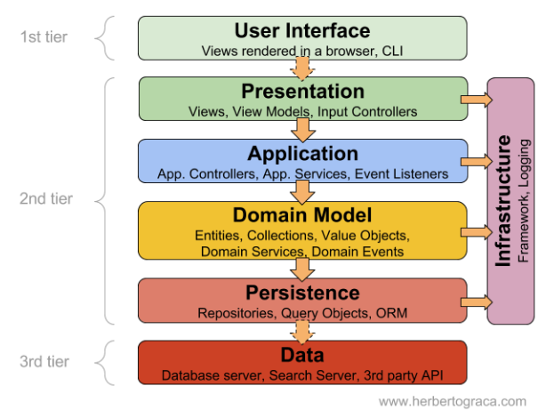
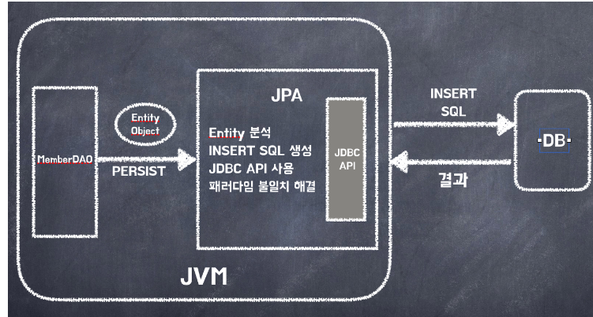
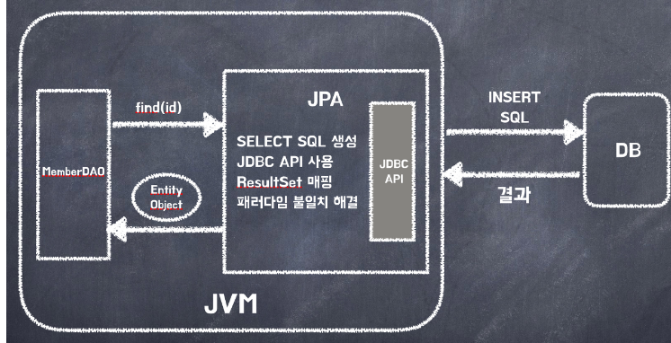
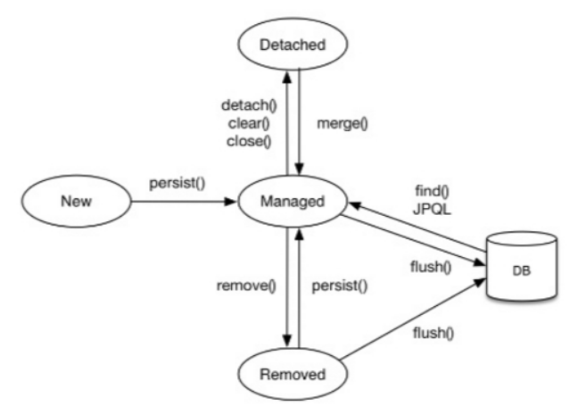
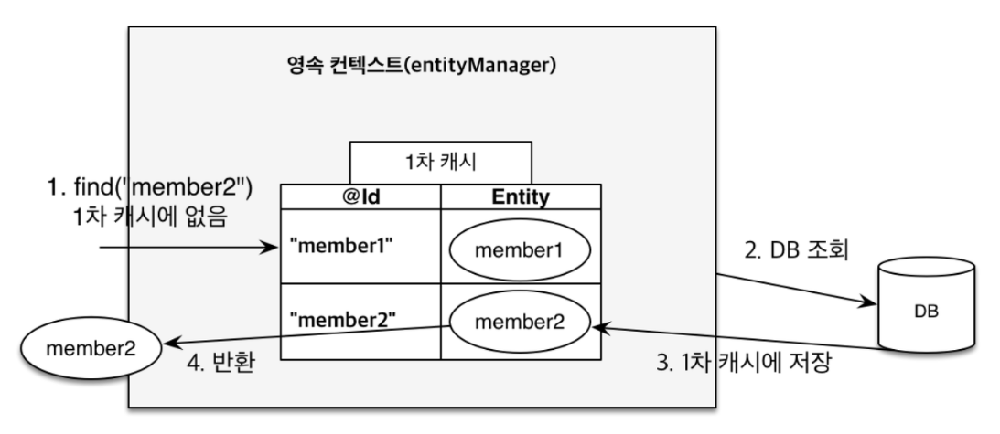
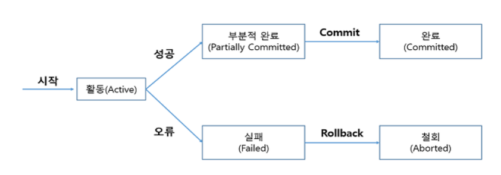
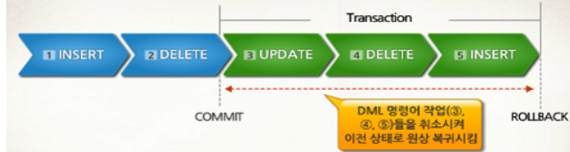

# 1. SQL Mapper와 ORM
## 1-1. SQL Mapper 의 장단점

> - **시작하기에 앞서**  
>   - 프로그램을 실행하면서 데이터가 생성되고 사용됨.
>   - 프로그램이 종료되어도 해당 데이터가 사라지지 않고 저장되는 과정이 필요함.
>   - 해당 특징을 ***영속성, persistance***라고 함.
>   
>   
> - Layered Architecture에서 다음과 같이 도메인 모델과 데이터베이스 사이에 존재
> - 프로그램의 객체정보를 DB에 저장하고, DB의 정보를 객체로 담아와 사용할 수 있도록 함.

### SQL Mapper?
> - Object와 SQL 필드를 매핑하여 데이터를 객체화하는 기술  
>   - SQL에 의존적
>   - SQL을 직접 작성하여 쿼리 수행 결과를 어떤 객체에 매핑할지 결정
>   - 객체와 테이블간의 매핑이 아님
>   - ex) MyBatis, JdbcTemplate
>> ### 장점
>> - JDBC를 사용했을 때 발생하는 불필요한 코드의 간소화  
>> - SQL이 코드와 분리되어 있기 때문에 유지보수 용이
>> - SQL 쿼리를 그대로 사용하기에 복잡한 JOIN, 튜닝 등을 좀 더 수월하게 작성 가능
>> - 동적 쿼리 생성에 유용
>>
>> ### 단점
>> - SQL 구문을 직접 작성해야 함 
>>   - db설정 변경 시 수정할 부분이 많음
>> - 유지보수 하락
>>   - 객체 모델, 관계 모델 각각 개발해야 함
>> - DBMS의 종속성 
>>   - Oracle, MS SQL, My SQL 등

### MyBatis
> - xml 파일에 따로 SQL을 관리하고 매핑을 도와줌
> - 동적쿼리(런타임 중에 조건에 따라 쿼리를 생성하고 실행하는것, 쿼리의 일부 또는 전체가 런타임 데이터나 사용자의 입력에 따라 변경)를 지원
>
>> ### 장점
>>   - 복잡한 쿼리의 경우 성능 튜닝에 유리하다.
>
>> ### 단점
>>   - DBMS에 종속적이다. 
>>   - 비슷한 쿼리를 반복적으로 작성해야 한다. 
>>   - 객체와 관계형 테이블 구조 사이에 패러다임 불일치 발생 
>>   - ex> 객체의 상속관계를 데이터베이스는 지원하지 않음


### JDBC
> - Java Database Connectivity
> - JAVA에서 DB에 접근하기 위해 만든 API
>
>>### 동작 방식
>>
>> 1. Driver manager로 접근해야할 DB 정보가 저장된 connection instance를 불러옴
>>    -  DriverManager.getConnection()
>> 2. statement를 이용하여 쿼리 실행
>> 3. DB로부터 데이터를 받아옴  
>>    - ResultSet()에 데이터를 받아오는데 리스트를 생성해서 해당하는 entity를 수동으로 삽입해야함
>
>>### 장점
>>  - 여러 DB의 Driver를 제공하여 동일한 접근 로직으로 어떠한 DB에도 접근 가능
>
>>### 단점
>> - 직접 작성해야 하는 코드가 많음
>>   - DB연결(종료), 예외처리, statement 준비, resultset 등
>> - 커넥션 관리(에러 발생 방지)
>> - DB별로 적절한 예외처리
>> - 결과값을 다시 data Type으로 매핑시켜주는 작업을 개발자가 일일히 수행해야 하는 번거로움  
>>
>> ---> ***SQL Mapper 등장***

## 1-2. ORM 의 장단점
### ORM?
> - Object Relation Mapping
> - 객체와 DB 테이블을 매핑하여 데이터를 객체화하는 기술.
> - CRUD 관련 메소드를 사용하면 자동으로 SQL이 만들어져 개발자가 반복적인 SQL을 직접 작성하지 않아도 됨.
> - DBMS에 종속적이지 않으며 복잡한 쿼리의 경우 JPQL을 사용하거나 SQL Mapper를 혼용하여 사용할 수 있음.
> - ex) Hibernate, EclipseLink, DataNucleus
> 
>> ### 장점
>> - 유지 보수 용이 
>>   - DB schema 변경시 소스 코드 변경 최소화 가능
>>   - ORM 프레임워크가 schema 변경을 자동으로 처리
>> - 가독성 향상
>>   - 객체지향프로그래밍 언어 문법 + 메서드 활용
>>   - 메서드 활용시 직관적이로 이해에 용이
>
>> ### 단점
>> - 성능
>>   - 대량의 데이터 처리시 성능에 문제 발생 가능성 증가
>> - 복잡성과 제약 사항
>>   - 모든 DB 기능을 제공해 주지는 않음
>>   - 일부 DB 기능 혹은 복잡한 쿼리는 sql로 직접 작성 필요

### JPA?
> - Java 진영에서 ORM(Object-Relational Mapping) 기술 표준으로 사용하는 인터페이스 모음
> - 자바 어플리케이션에서 관계형 데이터베이스를 사용하는 방식을 정의한 인터페이스
> - 인터페이스라서 Hibernate, OpenJPA 등이 JPA를 구현함
> 
>> ### 특징
>> - JPA는 반복적인 CRUD SQL을 처리해줌
>> - JPA는 매핑된 관계를 이용해서 SQL을 생성하고 실행하는데, 개발자는 어떤 SQL이 실행될지 생각만하면 되고, 예측도 쉽게 할 수 있음
>> - 네이티브 SQL이란 기능을 제공해주는데 관계 매핑이 어렵거나 성능에 대한 이슈가 우려되는 경우 SQL을 직접 작성하여 사용할 수도 있음
>> - SQL이 아닌 객체 중심으로 개발할 수 있음
>> -  생산성 증가 유지보수 용이, 패러다임의 불일치 해결
>## 참고
>> JPA는 수정 메소드를 제공하지 않음.
>> 데이터 수정시, 매핑된 객체(테이블 데이터)를 조회해서 값을 변경 후 커밋하면 DB 서버에 UPDATE 문을 전송하여 UPDATE를 실행
> ## 저장
> 
> ## 조회
> 

# 2. 영속화(Persistence)
## 2-1. 트랜젝션?
> - 데이터베이스의 상태를 변화시키기 해서 수행하는 작업의 단위
> - 작업의 단위는 질의어 한문장이 아님  
> ==> 많은 질의어 명령문들을 사람이 정하는 기준에 따라 정하는 것을 의미
>> ## 특징
>> 1. 원자성 (Atomicity)
>> - 트랜잭션이 데이터베이스에 모두 반영되던가, 아니면 전혀 반영되지 않아야 한다는 것
>> - 트랜잭션 단위로 데이터가 처리되지 않는다면  
>> ==> 설계한 사람은 데이터 처리 시스템을 이해하기 힘들 뿐만 아니라, 오작동 했을시 원인을 찾기가 매우 힘들어질것
>> 2. 일관성 (Consistency)
>> - 트랜잭션의 작업 처리 결과가 항상 일관성이 있어야 한다는 것
>> - 트랜잭션이 진행되는 동안에 데이터베이스가 변경 되더라도 업데이트된 데이터베이스로 트랜잭션이 진행되는것이 아님
>> - 처음에 트랜잭션을 진행 하기 위해 참조한 데이터베이스로 진행
>> - 이렇게 함으로써 각 사용자는 일관성 있는 데이터를 볼 수 있는 것
>> 3. 독립성 (Isolation)
>> - 둘 이상의 트랜잭션이 동시에 실행되고 있을 경우 어떤 하나의 트랜잭션이라도, 다른 트랜잭션의 연산에 끼어들 수 없다는 점
>> - 하나의 특정 트랜잭션이 완료될 때까지, 다른 트랜잭션이 특정 트랜잭션의 결과를 참조할 수 없음
>> 4. 지속성 (Durability)
>> - 트랜잭션이 성공적으로 완료됬을 경우, 결과는 영구적으로 반영되어야 한다는 것

## 2-2. 영속화
> - 영속화는 앞서 설명했던 것처럼 프로그램이 종료되어도 해당 데이터가 사라지지 않고 저장되는 과정임. 

### 영속성 컨텍스트 
> - 엔티티를 영구 저장하는 환경
> - 애플리케이션과 데이터베이스 사이에서 객체를 보관하는 가상의 데이터베이스 같은 역할
> - 엔티티 매니저를 통해 엔티티를 저장하거나 조회하면 엔티티 매니저는 영속성 컨텍스트에 엔티티를 보관하고 관리
> - ### 특징
>   - 엔티티 매니저를 생성할 때 하나 만들어짐 
>   - 엔티티 매니저를 통해서 영속성 컨텍스트에 접근하고 관리할 수 있음
>   - 엔티티를 식별자 값으로 구분한다. 따라서 영속 상태는 식별자 값이 반드시 있어야 함
>   - 트랜잭션을 커밋하는 순간 영속성 컨텍스트에 새로 저장된 엔티티를 데이터 베이스에 반영 == __flush__

### Entity lifecycle
>1. 비영속(new/transient): 영속성 컨텍스트와 전혀 관계가 없는 상태
>> Member member = new Member();
>2. 영속(managed): 영속성 컨텍스트에 저장된 상태, 영속성 컨텍스트에 의해 관리됨
>> em.persist(member);
>3. 준영속(detached): 영속성 컨텍스트에 저장되었다가 분리된 상태, 영속성 컨텍스트가 관리하던 영속 상태의 엔티티 더이상 관리하지 않음
>> // 엔티티를 영속성 컨텍스트에서 분리해 준영속 상태로 만든다.  
em.detach(member);  
// 영속성 콘텍스트를 비워도 관리되던 엔티티는 준영속 상태가 된다.  
em.claer();  
// 영속성 콘텍스트를 종료해도 관리되던 엔티티는 준영속 상태가 된다.  
em.close();  
>4. 삭제(removed): 엔티티를 영속성 컨텍스트와 데이터베이스에서 삭제
>> em.remove(member);
>> 여기서 managed는 entity manager를 의미
> 



### 1차 캐시
> - 영속성 컨텍스트 내부에는 캐시가 있는데 이를 1차 캐시라고 함
> - 영속 상태의 엔티티를 이곳에 저장
> - 1차 캐시의 키는 식별자 값(데이터베이스의 기본 키)이고 값은 엔티티 인스턴스  
> 
>> // em.find(엔티티 클래스 타입, 식별자 값);  
>>Member member = new Member();  
 member.setId("aaa");  
 member.setUsername("bbb");
>>#현재 비영속
>> 
>>em.persist(member);
>>#영속
>> 
>>Member findMember = em.find(Member.class, "aaa");
>>
>### 흐름
> 
>1. 1차 캐시에서 엔티티를 찾음
>2. 있으면 메모리에 있는 1차 캐시에서 엔티티를 조회
>3. 없으면 데이터베이스에서 조회
>4. 조회한 데이터로 엔티티를 생성해 1차 캐시에 저장 (엔티티를 영속상태로 만듦)
>5. 조회한 엔티티를 반환

### 트랜잭션 동작 원리
> - ALL-OR-Nothing(모든것을 수행하던지 아무것도 하지말던지) 방식으로 DML 명령어들을 처리
>>COMMIT  
>> - 내가 적은 쿼리문과 데이터를 최종적으로 데이터베이스에 반영
>>
>> ROLLBACK   
>> - 실패했을때 COMMINT 시점으로 다시 되돌아감
>
>
> 1. 활동 : 트랜잭션이 실행 중에 있는 상태, 연산들이 정상적으로 실행 중인 상태
> 2. 실패 : 트랜잭션이 실행에 오류가 발생하여 중단된 상태
> 3. 철회 : 트랜잭션이 비정상적으로 종료되어 ROLLBACK 연산을 수행한 상태
> 4. 부분적 완료 : COMMIT 연산이 실행되기 직전의 상태로 아직 작성한 것들을 저장하지 않은 상태 
> 5. 완료 : 트랜잭션이 성공적으로 종료되어 COMMIT 연산을 실행한 후의 상태
> 
> ## commit
> - 완전 저장
> - 모든 작업들을 정상적으로 처리하겠다고 확정하는 명령어
> - 처리과정을 DB에 영구 저장
> - COMMIT을 수행하면 하나의 트랜잭션 과정을 종료하는 것
> - COMMIT을 수행하면 이전 데이터가 완전히 UPDATE
> ## commit
> 작업 중 문제가 발생되어 트랜잭션의 처리과정에서 발생한 변경사항을 취소하는 명령어
> 트랜잭션이 시작되기 이전의 상태로 되돌림
> 마지막 COMMIT을 완료한 시점으로 다시 돌아감
> COMMIT하여 저장한 것만 복구
> 

# 3. Spring Data JPA
## 3-1. JPA 와 Spring Data JPA의 차이점
> - JPA
>> - Java Persistence API 
>> - 자바 애플리케이션에서 관계형 데이터베이스를 사용하는 방식을 정의한 인터페이스와 어노테이션의 표준 집합
>> - 자바 어플리케이션에서 관계형 데이터베이스를 어떻게 사용해야 하는지를 정의하는 한 방법
>> - 단순한 명세이기에 구현은 없고, 다양한 ORM 프레임워크(예: Hibernate, EclipseLink, OpenJPA 등)에서 구현할 수 있는 공통 API를 제공
> - Spring Data JPA
>> - Spring에서 제공하는 모듈 중 하나
>> - JPA 위에 추가적인 기능을 제공하여 JPA 기반 애플리케이션 개발을 보다 간편하게 만드는 라이브러리/프레임워크
>> - Repository 인터페이스를 제공함으로써 이루어짐
>> - 사용자가 Repository 인터페이스에 정해진 규칙대로 메서드를 입력하면, Spring이 알아서 해당 메서드 이름에 적합한 쿼리를 날리는 구현체를 만들어서 Bean으로 등록
>> - CRUD 연산, 정렬과 같은 JPA 레포지토리를 구현하는 데 필요한 반복적인 코드 양을 줄이는 인터페이스와 클래스를 제공
>> - 쿼리 메서드와 사용자 정의 쿼리를 지원

## 3-2. JPA annotation
### @Entity
> - DB의 테이블과 1:1로 매칭되는 객체 단위  
> - Entity 객체의 인스턴스 하나가 테이블에서 하나의 레코드 값을 의미하며 테이블과 매핑할 클래스에 필수로 붙여야함
> - 객체의 인스턴스를 구분하기 위한 유일한 키값이 존재  
> ==> 테이블 상의 Primary Key 와 같은 의미, @Id 어노테이션으로 표기
>> 주의 사항
>> - 기본 생성자는 필수(파라미터가 없는 public 또는 protected 생성자)
>> - final 클래스, enum, interface, inner 클래스에는 사용할 수 없음
>> - 저장할 필드에 final을 사용하면 안됨

### @Table
> - 엔티티와 매핑할 테이블을 지정
> - 생략하면 매핑한 엔티티 이름을 테이블 이름으로 사용
>>@Entity  
>>@Table(name = "Member")  
>>public class Member {  
>>     ...  
>> }  
>>  
>>@Entity  
>>public class MemberA {   
>> ...  
>> }  


### @Column
> - 데이타베이스의 테이블에 있는 컬럼과 동일하게 1:1로 매칭
> - Entity 클래스안에 내부변수로 정의
> - 만약 테이블에 a, b, c 컬럼이 있다면 각각 3개의 @Column 어노테이션을 작성
> - 의도적으로 필요없는 컬럼들은 장성하지 않아도 되는데 데이타베이스 테이블에 실제 a, b, c, d 총 4개의 컬럼이 있더라도 a, b, c 컬럼만 Entity 클래스에 작성해도 무방
> - 이때 @Column 어노테이션은 별다른 옵션을 설정하지 않는다면 생략이 가능함
> - @Entity 어노테이션과 동일하게 name 속성을 명시하지 않으면 Entity 클래스에 정의한 컬럼 변수의 이름으로 생성
> - length 속성으로 길이를 명시 가능하며 없다면 기본 길이인 255가 지정  
> ==> 문자열 형태인 데이터 속성에만 해당 되며 큰 숫자를 표현하는 BigDecimal 일 결우 precision, scale 로 최대 길이를 지정 할 수 있다.

### @Id
> - 테이블 상에 PK 가 없는 테이블도 있지만 대부분의 경우 반드시 PK 가 존재한다.
> - JPA에서 Entity 클래스 상에 해당 PK 를 명시적으로 표시를 해야함
> ==> @Id 어노테이션을 이용해 PK 임을 지정

### @GeneratedValue
> - PK 컬럼의 데이타 형식은 정해져 있지는 않으나 구분이 가능한 유일한 값을 가지고 있어야 함
> - 데이터 경합으로 인해 발생되는 데드락 같은 현상을 방지 하기 위해 대부분 BigInteger 즉 Java 의 Long 을 주로 사용
> - Mysql은 auto increment 방식을 사용한다.
> - DB에서 자동으로 주입하게 함.

### @OneToMany
> - 한 객체가 여러 객체를 가질 수 있는 일대다 관계
> - ex) 하나의 부서(Department)는 여러 직원(Employee)을 가질 수 있음
> ==> 이 경우 부서 객체는 직원 객체들과의 일대다 관계를 가짐
```
@Entity  
public class Department {  
    @Id  
    @GeneratedValue(strategy = GenerationType.IDENTITY)
    private Long id;
    
    private String name;

    @OneToMany(mappedBy = "department")
    private List<Employee> employees;

    // Getters and Setters
}
```

### @ManyToOne
> - 여러 객체가 하나의 객체를 가질 수 있는 다대일 관계
> - ex) 여러 직원(Employee)이 하나의 부서(Department)에 속할 수 있음  
> ==> 이 경우 직원 객체는 부서 객체와의 다대일 관계를 가짐
```
@Entity
public class Employee {
    @Id
    @GeneratedValue(strategy = GenerationType.IDENTITY)
    private Long id;
    
    private String name;

    @ManyToOne
    @JoinColumn(name = "department_id")
    private Department department;

    // Getters and Setters
}
```
### Spring Data JPA 의 기본 제공 메서드
1. save(S entity)
> - 주어진 엔티티를 저장
> - 만약 해당 엔티티의 ID가 null이거나 데이터베이스에 존재하지 않는다면 새로운 엔티티를 생성하고, 그렇지 않다면 기존 엔티티를 업데이트
> - 매개변수: entity
> - 반환값: 저장된 엔티티
2. saveAll(Iterable\<S> entities)
> - 주어진 엔티티들의 컬렉션을 저장
> - 매개변수: entities
> - 반환값: 저장된 엔티티들의 컬렉션
3. findById(ID id)
> - 주어진 ID에 해당하는 엔티티를 찾음 
> - 해당 엔티티가 존재하지 않는 경우 Optional.empty()를 반환
> - 매개변수: id 
> - 반환값: 찾은 엔티티를 포함하는 Optional 객체
4. findAll()
> - 모든 엔티티를 조회
> - 반환값: 모든 엔티티의 리스트
5. delete(T entity)
> - 주어진 엔티티를 삭제
> - 매개변수: entity
6. deleteAll(Iterable<? extends T> entities)
> - 주어진 엔티티들의 컬렉션을 삭제합니다.
> - 매개변수: entities
7. count()
> - 엔티티의 총 개수를 반환
> - 반환값: 엔티티의 총 개수
8. existsById(ID id)
> - 주어진 ID를 가진 엔티티가 존재하는지 여부를 확인
> - 매개변수: id
> - 반환값: 엔티티가 존재하면 true, 그렇지 않으면 false

### Spirng Data JPA 네이밍 규칙

# 4. JPQL
## 4-1. JPQL이란?
> - JPA는 SQL을 추상화한 JPQL이라는 객체 지향 쿼리 언어를 제공  
> ==> 테이블을 대상으로 쿼리 하는 것이 아닌 엔티티 객체를 대상으로 쿼리
> - SQL을 추상화했기 때문에 특정 데이터베이스 SQL에 의존하지 않는 장점
> - JPQL은 SQL과 문법이 유사하며, SELECT, FROM, WHERE, GROUP BY, HAVING, JOIN을 지원 
> 
> PQL은 SQL로 변환
 
### JPQL 사용 예시
```
String jpql = "select m From Member m where m.name like ‘%hello%'";
List<Member> result = em.createQuery(jpql, Member.class).getResultList();

for (Member member : result) {
System.out.println("member = " + member);
}

# 위 코드에서는 Member 객체를 대상으로 이름에 “hello”가 포함된 모든 회원을 검색
```

### JPQL의 문제점
> - 기본 문자열로 작성되기 때문에 컴파일 시 에러 발생 X  
> ==> 문제가 있음에도 불구하고 정상적으로 작동하여 배포 시 문제가 발생할 수 있음
>
> - 동적으로 쿼리 언어를 작성하는 데 효율적이지 못하다.
> - ex) 특정 조건의 참일 경우엔 A SQL 쿼리를, 거짓일 경우엔 B 쿼리를 실행하는 등
>
> ### JPQL과 SQL의 가장 뚜렷한 차이
> - JPQL은 엔티티 객체를 대상으로 쿼리문을 작성
> - SQL은 데이터베이스 테이블을 대상으로 쿼리문을 작성
>
> ### JPQL 문법은 SQL 문법과 매우 유사
>> select _ from _ [where] _ [groupby] _ [having] _ [orderby]_ 
>
>> update _ [where] _ 
> 
>> delete _ [where] _  

### JPQL 특징
```
select m from Member as m where m.age > 18
```
> 1. 엔티티와 속성은 대소문자를 구분  
> - (Member(엔티티), age(속성))
> 2. @Entity의 name을 지정하지 않으면, 클래스 이름이 엔티티 이름
> 3. JPQL 키워드는 대소문자를 구분하지 않음 (Select, FROM, where)
> 4. 테이블 이름이 아닌 엔티티 이름을 사용 (Member, Team)
> 5. 별칭(m) 사용은 필수적
> 6. as는 생략이 가능
> 7.  관계형 데이터베이스의 집합과 정렬 등의 함수를 제공  
>```
>select
>COUNT(m), // Member 수
>SUM(m.age), // Member의 나이 합
>AVG(m.age), // Member의 평균 나이
>MAX(m.age), // Member의 최대 나이
>MIN(m.age) // Member의 최소 나이
>from Member m
>```
> 8. GROUP BY, HAVING, ORDER BY 등 모두 사용이 가능하다.
